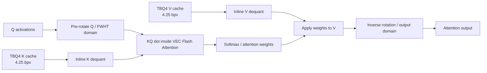
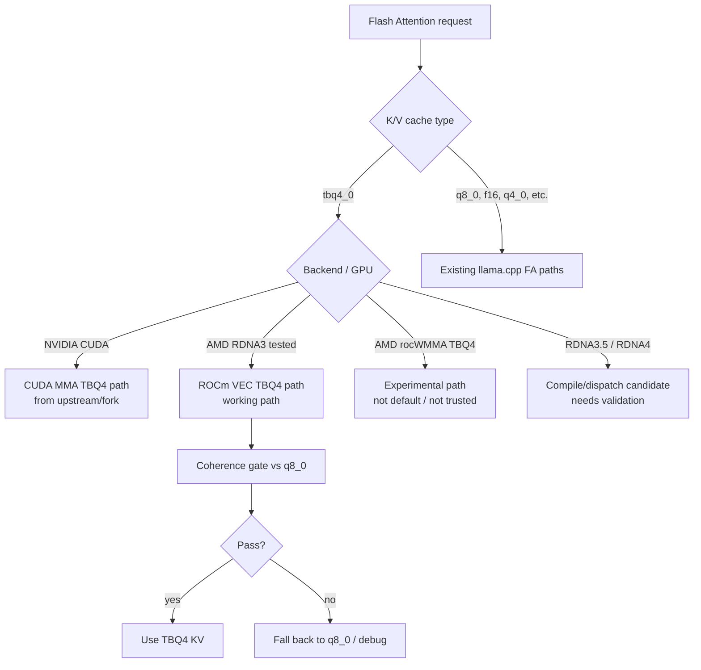

# llama.cpp ROCm TBQ4 KV Cache — production-stable MTP path for RX 7900 XTX

This branch brings the TBQ4 KV-cache path to AMD ROCm/RDNA3, tested on an RX 7900 XTX (`gfx1100`). It now has a validated 32k/64k Qwen3.6-27B MTP server path with bounded VRAM, no request-time ROCm OOM, and clean shutdown.

The goal is simple:

- keep long-context VRAM use low with TBQ4 KV cache,
- keep MTP/speculative decoding working,
- keep the default production Flash Attention route on the stable VEC path,
- avoid the broken rocWMMA prototype path for now,
- validate output against a `q8_0` KV baseline before calling it usable.

This is not a general "all AMD GPUs are supported" claim. The tested target is RDNA3 / RX 7900 XTX. RDNA3.5 and RDNA4 are compile/dispatch candidates, but still need real validation.

## Current result

Test setup:

- GPU: RX 7900 XTX, 24 GB
- Backend: ROCm/HIP, tested with ROCm 7.2.3
- Model: Qwen3.6 27B MTP GGUF, Q4_K_M
- Context: 32k and 64k production smokes
- KV cache: `tbq4_0`
- MTP: `--spec-type mtp --spec-draft-n-max 3`
- Stable MTP env: `LLAMA_MTP_PREFILL_CHUNK=512 LLAMA_MTP_PREFILL_FORCE_MMQ=1`
- Server flags: `--flash-attn on --batch-size 1024 --ubatch-size 512 --cache-ram 128 --parallel 1`

Production smoke result from this branch:

| KV cache | Context | HTTP | Prompt | Decode | Peak VRAM | Shutdown |
|---|---:|---:|---:|---:|---:|---:|
| `tbq4_0` | 32k | 200 | ~466.6 tok/s | ~47.5 tok/s | ~20.7 GiB | clean, `server_rc=0` |
| `tbq4_0` | 64k | 200 | ~481.4 tok/s | ~38.6 tok/s | ~21.3 GiB | clean, `server_rc=0` |
| `q8_0` | 16k | 200 | — | ~50 tok/s | ~22 GiB | historical comparison |

No ROCm OOM, no `ggml_cuda_op_mul_mat_cublas` fallback stack, and no shutdown double-free were observed in the 32k/64k TBQ4+MTP smokes.

The important point: TBQ4 made 64k context fit while keeping MTP generation usable on a 24 GB RX 7900 XTX.

## What changed

| Area | Status | Notes |
|---|---|---|
| TBQ4 VEC Flash Attention | Working | Dequant happens inside the FA loop; no separate dequant pass |
| MTP speculative decoding | Working | Best observed setting here: `--spec-draft-n-max 3` |
| MTP prefill allocator stability | Working | `LLAMA_MTP_PREFILL_CHUNK=512` plus `LLAMA_MTP_PREFILL_FORCE_MMQ=1` avoids the hipBLAS temp-allocation OOM path |
| MTP server shutdown | Fixed | Speculative state is released before the target context/model, so MTP detach no longer double-frees |
| Coherence gate | Passing | TBQ4 compared against `q8_0` next-token distributions |
| rocWMMA TBQ4 | Experimental | Built during investigation, but not the working path |
| RotorQuant / `tbq4_0` | Production-smoked on gfx1100 | 32k/64k TBQ4+MTP server smokes pass cleanly |
| PlanarQuant / IsoQuant (`planar3_0`, `iso3_0`) | Fixed and gated | Compressed-KV materializers/dispatch are covered by the Triton oracle + invariant gates; opt-in WMMA remains behind `COMPRESSED_KV_WMMA_FATTN=1` |

## Why VEC, not the experimental AMD rocWMMA path?

The first ROCm TBQ4 attempt used rocWMMA. It was stable enough to run, but the output was wrong.

The working path is the simpler VEC Flash Attention path — the same approach [Stormrage34/llama.cpp-turboquant-hip](https://github.com/Stormrage34/llama.cpp-turboquant-hip) first validated for AMD (`turbo2/3/4` types), adapted here for the `tbq4_0` block format:

1. read TBQ4 K/V blocks,
2. dequantize inside the attention loop,
3. apply the TBQ4 rotation model correctly,
4. validate output against `q8_0`.

That path is slower than a mature native matrix-core implementation could be, but it is correct enough to use and debug.

### TBQ4 VEC Flash Attention path



TBQ4 is not first expanded globally. Dequant happens inside the attention path.

### Dispatch decision



This separates working, experimental, and untested instead of blending them together.

## Build (ROCm / RX 7900 XTX)

### Prerequisites

- ROCm 7.2.3+ (tested: `/opt/rocm-7.2.3`)
- HIP compiler: `/opt/rocm-7.2.3/bin/amdclang++`
- GPU: RDNA3 (`gfx1100`/`gfx1101`/`gfx1102`/`gfx1103`)
- Model: Qwen3.6 MTP GGUF (see below)

### Build

```bash
git clone https://github.com/DrBearJew/llama.cpp.git
cd llama.cpp
git checkout tbq4-rdna3-experiment

cmake -B build-rocm -DGGML_HIP=ON \
  -DGGML_HIP_ROCWMMA_FATTN=ON \
  -DAMDGPU_TARGETS=gfx1100 \
  -DCMAKE_HIP_COMPILER=/opt/rocm-7.2.3/bin/amdclang++ \
  -DCMAKE_BUILD_TYPE=Release

cmake --build build-rocm --target llama-server -j8
```

### Run

```bash
# TBQ4 KV (low VRAM, 4.25 bpv) with MTP — validated 64k ROCm path
LLAMA_MTP_PREFILL_CHUNK=512 \
LLAMA_MTP_PREFILL_FORCE_MMQ=1 \
./build-rocm/bin/llama-server \
  -m /path/to/Qwen3.6-27B-Q4_K_M-mtp.gguf \
  --cache-type-k tbq4_0 --cache-type-v tbq4_0 \
  --flash-attn on \
  --batch-size 1024 --ubatch-size 512 --cache-ram 128 \
  --spec-type mtp --spec-draft-n-max 3 \
  --jinja --chat-template-file docs/rocm-tbq4-paths/qwen36-merged-template.jinja \
  -c 65536 --port 8080 --no-webui --no-warmup --parallel 1

# q8_0 KV (higher speed, more VRAM)
./build-rocm/bin/llama-server \
  -m /path/to/Qwen3.6-27B-Q4_K_M-mtp.gguf \
  --cache-type-k q8_0 --cache-type-v q8_0 \
  --flash-attn on \
  -c 16384 --port 8080 --no-webui --no-warmup
```

### Chat template (Qwen 3.6)

Use the merged template included in this repo (`docs/rocm-tbq4-paths/qwen36-merged-template.jinja`).
It supports `<|think_off|>`, developer role, and tool calls.

Source repos:
- [allanchan339/vLLM-Qwen3-Chat-Template-Fix](https://github.com/allanchan339/vLLM-Qwen3-3.5-3.6-chat-template-fix)
- [froggeric/Qwen-Fixed-Chat-Templates](https://huggingface.co/froggeric/Qwen-Fixed-Chat-Templates)

## MTP finding

The llama.cpp server default for `--spec-draft-n-max` is 16. On this setup, that was too aggressive and lowered aggregate acceptance.

For this model/backend, `--spec-draft-n-max 3` gave the best observed result:

| KV cache | `n_max` | Drafted | Accepted | Accept rate | Speed |
|---|---:|---:|---:|---:|---:|
| `q8_0` | 3 | 57 | 44 | 77.2% | 49.8 tok/s |
| `tbq4_0` | 3 | 54 | 45 | 83.3% | 54.0 tok/s |
| `tbq4_0` | 16 | 144 | 53 | 36.8% | 38.1 tok/s |

This does not prove TBQ4 improves MTP acceptance. It shows that, **in this tested run**, TBQ4 did not damage acceptance compared with `q8_0`.

## Validation

The coherence gate compares TBQ4 against a `q8_0` KV baseline. It does not compare against FP16 or FP32 — `q8_0` is itself quantized.

Quick-mode result (4k context):

| Layer | Result | Notes |
|---|---|---|
| Smoke | PASS | Basic deterministic prompts |
| Precision | PASS | 100% top-1 match, 0.945 Jaccard, 0.0017 JSD vs `q8_0` |
| Canaries | PASS | JSON, ChatML leak guard, tool-call schema, code syntax |
| MTP | PASS | 83.3% acceptance in the tested run |
| Cache | PASS | Same output with and without `cache_prompt` |

This is a practical correctness gate, not a proof of mathematical losslessness.

Compressed-KV prototype/gate coverage also includes `planar3_0` and `iso3_0`:

| Gate | Formats | Result |
|---|---|---|
| `experiments/compressed_kv_triton/run_all.sh` | `planar3_0`, `iso3_0`, `tbq4_0` | PASS |
| `run_all_json.py` | `planar3_0`, `iso3_0`, `tbq4_0` | PASS 20/20 |
| `scripts/hip/check-compressed-kv-fa-invariants.sh` | production dispatch/gating | PASS |

The long-context production server smokes above are TBQ4-focused. Planar/Iso are fixed and covered by the compressed-KV gates, but their WMMA route remains opt-in rather than the default production path.

### Run the gate

```bash
cd docs/rocm-tbq4-paths

# Quick mode (< 5 min, 4k ctx)
python3 harness.py --quick

# Full gate (64k ctx, needle retrieval, long prompts)
python3 harness.py --tbq4-ctx 65536 --q8-ctx 16384
```

Results are written to `gate-summary.json`.

## Benchmarks (RX 7900 XTX, Qwen3.6-27B Q4_K_M)

### Generation / server smoke

| KV cache | Context | MTP | Prompt tok/s | Decode tok/s | Peak VRAM | Exit |
|---|---:|---|---:|---:|---:|---:|
| `tbq4_0` | 64k | yes, `n_max=3` | ~481.4 | ~38.6 | ~21.3 GiB | `server_rc=0` |
| `tbq4_0` | 32k | yes, `n_max=3` | ~466.6 | ~47.5 | ~20.7 GiB | `server_rc=0` |
| `tbq4_0` | 16k | yes, `n_max=3` | historical | 36–38 | ~17 GiB | — |
| `q8_0` | 32k | no | historical | ~31 | ~23 GiB | — |
| `q8_0` | 16k | yes, `n_max=3` | historical | ~50 | ~22 GiB | — |

### Prefill

| KV cache | Prefill | Context | tok/s |
|---|---|---|---|
| `tbq4_0` (after KQ fix) | 28k tokens | 64k | 360.8 |
| `tbq4_0` (before fix) | 28k tokens | 64k | 100.8 |
| `q8_0` | 14k tokens | 16k | 394.2 |
| `tbq4_0` (after KQ fix) | 14k tokens | 16k | 537.7 |

### RDNA3 MoE MMQ accelerator (Qwen3.6 35B-A3B IQ4_XS)

LDS double-buffered `mul_mat_q` prefill accelerator behind `RDNA2_MATMUL_OPT_V1=1`.
Compile with `-DRDNA2_MATMUL_OPT_V1=1`, enable at runtime with env var.

| Mode | pp128 | pp256 | tg32/tg64 |
|---|---|---|---|
| Baseline | 1258 ± 47 | 1939 ± 53 | 79.4 ± 0.7 |
| **`RDNA2_MATMUL_OPT_V1=1`** | **2706 ± 57** | **3985 ± 50** | 79.9 ± 1.2 |
| Delta | **+115%** | **+105%** | flat |

Dense models (Q4_K_M 27B): pp128 646 → 673 (+4%, within noise). Decode unaffected.
Based on Stormrage34's RDNA2 matmul optimization approach.

### Cooperative TBQ4 set_rows + InnerQ + Layer-Adaptive KV

Experimental features behind env flags on this branch:

| Flag | Feature | Status |
|---|---|---|
| `TBQ4_COOP_SET_ROWS=1` | Cooperative 128-thread TBQ4 set_rows | Prefill neutral (−1-2%), harness passes |
| `AMD_BFE` | `__builtin_amdgcn_ubfe` nibble extraction (compile-time) | 6 unconditional sites, enabled in AMD build |
| `TBQ4_INNERQ=256` | Per-channel K/V equalization (calibration → forward scale) | Smoke passes; MoE 27B RMS 1.81 (scales 0.66–1.52), MoE 35B RMS 1.15 (scales 0.96–1.08) |
| `TBQ4_LAYER_ADAPTIVE=7` | Boundary-V mixed precision (q8_0 for first+last 2 layers V) | Builds, to-benchmark |

## Key files changed

| File | Purpose |
|---|---|
| `ggml/src/ggml-cuda/fattn-common.cuh` | `vec_dot_fattn_vec_KQ_tbq4_0`, `dequantize_V_tbq4_0` |
| `ggml/src/ggml-cuda/fattn-vec.cuh` | `DECL_FATTN_VEC_CASE` for TBQ4 D=64/128/256 |
| `ggml/src/ggml-cuda/fattn.cu` | Routes AMD WMMA-capable targets to TBQ4 VEC |
| `ggml/src/ggml-cuda/mmq.cu` | Env-gated MTP prefill MMQ routing for supported quantized matmuls |
| `ggml/src/ggml-cuda/mmq.cuh` | 256-thread MMQ workgroup cleanup plus diagnostic `GGML_CUDA_MMQ_MAX_X` |
| `src/llama-context.cpp` | MTP prefill chunking and safer hook-batch storage |
| `src/llama-mtp.h` | Vector-backed hook batch storage |
| `tools/server/server-context.cpp` | Releases speculative MTP state before freeing the target context |
| `src/llama-kv-cache.cpp` | Disables generic `attn_rot_*` for TBQ4 |
| `ggml/src/ggml-cuda/fattn-wmma-tbq4.cu` | Experimental rocWMMA path (research only) |

### Bugs fixed

1. **VEC correctness**: `dequantize_V_tbq4_0` used wrong index; TBQ4 was double-rotated via generic Hadamard
2. **VEC prefill speed**: TBQ4 KQ dot used f16-style `Q_reg` but RDNA quantized lane mapping → fixed with `KQ_uses_Q_reg` + `nthreads_KQ=8`
3. **Rotation model**: TBQ4 stores K/V in signed-FWHT domain; Q pre-rotated, output inverse-rotated
4. **MTP request-time OOM**: draft-prefill hipBLAS temp allocation could request multi-GiB buffers; supported quantized MTP prefill matmuls can be routed through MMQ with `LLAMA_MTP_PREFILL_FORCE_MMQ=1`
5. **MTP shutdown double-free**: server cleanup freed the target context before speculative MTP state detached from it; speculative state now resets first

## GPU architecture status

Emphasis: "enabled" means the code dispatches, not that the path has been tested.

| Family | Targets | Status |
|---|---|---|
| RDNA3 | gfx1100/1101/1102/1103 | **Tested on gfx1100** — VEC FA + MTP verified |
| RDNA3.5 | gfx1150/1151/1152 | Dispatch candidate — same VEC path, **untested** |
| RDNA4 | gfx1200/1201+ | Dispatch candidate — `amd_wmma_available()` gate enabled, **untested** |
| RDNA1/RDNA2 | gfx10xx | Not routed to TBQ4 VEC |
| CDNA/MI* | gfx9x/gfx94x | Not routed |
| NVIDIA | sm_80/sm_89/sm_90 | Existing CUDA MMA TBQ4 path from upstream |

Validation steps for a new GPU family:

1. build with `AMDGPU_TARGETS=<gfx>`,
2. run smoke + precision probes (harness quick mode),
3. run at least 8k and 32k needle tests,
4. run MTP acceptance test,
5. record VRAM and throughput separately from correctness.

## Getting an MTP-capable GGUF

**Option A — Pre-built (recommended)**

```bash
# llmfan46's pre-built GGUF with 15 native MTP heads (~17 GB, Q4_K_M)
wget https://huggingface.co/llmfan46/Qwen3.6-27B-uncensored-heretic-v2-Native-MTP-Preserved-GGUF/resolve/main/Qwen3.6-27B-uncensored-heretic-v2-Native-MTP-Preserved-Q4_K_M.gguf
```

**Option B — Graft MTP heads onto any Qwen3.6 GGUF**

```bash
wget https://huggingface.co/havenoammo/Qwen3.6-27B-MTP-UD-GGUF/resolve/main/MTP-Q8_0.gguf
uv pip install gguf
python convert.py base-model.gguf MTP-Q8_0.gguf output-mtp.gguf
```

## Key flags

| Flag | Purpose |
|---|---|
| `--cache-type-k tbq4_0 --cache-type-v tbq4_0` | TBQ4 KV cache (low-error compressed, 4.25 bpv) |
| `--cache-type-k q8_0 --cache-type-v q8_0` | q8_0 KV cache (higher speed, more VRAM) |
| `--flash-attn on` | Required for quantized V cache |
| `--batch-size 1024 --ubatch-size 512` | Validated MTP+TBQ4 server batch settings |
| `--cache-ram 128` | Keeps host-side prompt/cache reuse bounded in the tested server setup |
| `--spec-type mtp --spec-draft-n-max 3` | MTP; `n_max=3` was best observed here |
| `LLAMA_MTP_PREFILL_CHUNK=512` | Chunks target hidden-state transfer into draft-prefill decode calls |
| `LLAMA_MTP_PREFILL_FORCE_MMQ=1` | Env-gated workaround for MTP draft-prefill hipBLAS/ROCm temp allocation OOM |
| `--jinja --chat-template-file <path>` | Qwen merged chat template |
| `--parallel 1` | Required for MTP |
| `--no-warmup` | Skip startup warmup |

## Credits

### ROCm TBQ4 VEC path

- **[Stormrage34/llama.cpp-turboquant-hip](https://github.com/Stormrage34/llama.cpp-turboquant-hip)** — **First working AMD VEC TurboQuant path** (RDNA2, `turbo2/3/4` KV types, BFE dequant, MoE LDS accelerator). Our TBQ4 VEC path follows the same inline-dequant-inside-FA pattern, adapted for the `tbq4_0` block format and RDNA3.
- **[TheTom/llama-cpp-turboquant](https://github.com/TheTom/llama-cpp-turboquant)** — Original TurboQuant reference implementation (block formats, FWHT rotation model, centroids)
- **[adelj88/rocm_wmma_gemm](https://github.com/adelj88/rocm_wmma_gemm)** — rocWMMA reference used in the experimental prototype
- **[Kaden-Schutt/hipfire](https://github.com/Kaden-Schutt/hipfire)** — MMQ screening concept that inspired the coherence gate design

### MTP and TurboQuant foundation

- **[Indras-Mirror/llama.cpp-mtp](https://github.com/Indras-Mirror/llama.cpp-mtp)** — Base fork with fused CUDA MMA TBQ4 FA, MTP, RotorQuant, tensor sharing
- **[ggml-org/llama.cpp](https://github.com/ggml-org/llama.cpp)** — PR #22673 (MTP support by ngxson, am17an), PR #21089 (CPU TBQ)
- **[spiritbuun](https://github.com/spiritbuun)** — dflash fork with CUDA TurboQuant kernels
- **[ikawrakow/ik_llama.cpp](https://github.com/ikawrakow/ik_llama.cpp)** — MTP improvements PR #1736

### Models and tooling

- **[llmfan46](https://huggingface.co/llmfan46)** — Qwen3.6-27B-Heretic-v2 Native-MTP-Preserved GGUF
- **[HauhauCS](https://huggingface.co/HauhauCS)** — Original Qwen3.6-Heretic-v2 uncensored base model
- **[havenoammo](https://huggingface.co/havenoammo)** — MTP graft tooling, first Qwen3.6-MTP GGUF release
- **[Radamanthys11](https://huggingface.co/Radamanthys11)** — MTP-Q8_0 GGUF extraction

### Chat templates

- **[allanchan339/vLLM-Qwen3-Chat-Template-Fix](https://github.com/allanchan339/vLLM-Qwen3-3.5-3.6-chat-template-fix)** — Tool system prompt, developer role
- **[froggeric/Qwen-Fixed-Chat-Templates](https://huggingface.co/froggeric/Qwen-Fixed-Chat-Templates)** — `<|think_on|>`/`<|think_off|>` toggles, `</thinking>` recognition

---

<details>
<summary><strong>Original NVIDIA benchmarks and docs (from Indras-Mirror)</strong></summary>

## NVIDIA results (RTX 4090 24GB, Qwen3.6-27B-Heretic-v2-MTP Q4_K_M)

| Config | Context | KV cache | tok/s | Draft accept | VRAM |
|---|---|---|---|---|---|
| MTP + Fused TBQ4 FA | 262K | TBQ4_0 (4.25 bpv) | 80–179 | 73–93% | ~20 GB |
| MTP + Q4_0 KV | 200K | Q4_0 (4.5 bpv) | 92–97 | 93.6% | 23.96 GB |
| Baseline (no MTP, Q4_0 KV) | 200K | Q4_0 | ~40 | — | 23.96 GB |

### NVIDIA build

```bash
cmake -B build -DGGML_CUDA=ON -DCMAKE_BUILD_TYPE=Release -DCMAKE_CUDA_ARCHITECTURES=89
cmake --build build -j$(nproc) --config Release

./build/bin/llama-server \
  -m your-qwen3.6-mtp.gguf \
  --spec-type mtp --spec-draft-n-max 3 \
  -ctk tbq4_0 -ctv tbq4_0 -c 262144 -ngl 99 \
  --flash-attn on --mlock -t 8 -ub 32 --parallel 1 --no-warmup
```

### RotorQuant benchmarks (RTX 4090)

| Type | 4K ctx | 32K ctx | 262K ctx | Notes |
|---|---|---|---|---|
| `tbq4_0` | 55.3 t/s | 51.5 t/s | 77 t/s | Baseline — fused MMA kernel |
| `planar3_0` | 53.9 t/s | 50.6 t/s | ~47 t/s | Best speed/compression tradeoff |
| `iso3_0` | 53.5 t/s | 50.5 t/s | — | Same compression as planar3 |

### NVIDIA TBQ4 MMA architecture

Fused TBQ4 Flash Attention pipeline:

1. `k_tbq4_rotate_input` → Pre-rotate Q via FWHT
2. Fused FA kernel → Read raw TBQ4 blocks, centroid×norm dequant inline
3. `k_tbq4_rotate_output` → Post-rotate VKQ back to original domain

TBQ4_0 block: 66 bytes per 128 elements (4.25 bpv)

- `ggml_half d` — corrected L2 norm (2 bytes)
- `uint8_t qs[64]` — packed 4-bit centroid indices (64 bytes)
- 16 Lloyd-Max centroids in `__constant__` memory

### Tensor sharing

```cpp
LLAMA_API void llama_model_link_shared_tensors(
    struct llama_model * model,
    const struct llama_model * trunk);
```

### Known issues (from upstream)

- Vision + MTP crashes. Use `--spec-type none` for vision tasks.
- MTP requires `--parallel 1`.
- 7B models crash with TBQ4 (16-byte alignment).
- MoE models may fail if GGUF metadata is incomplete.

</details>

## License

MIT. See upstream [llama.cpp](https://github.com/ggml-org/llama.cpp).
