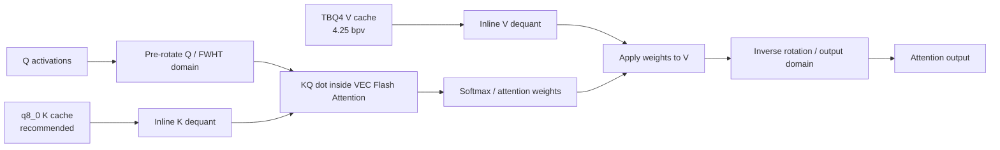
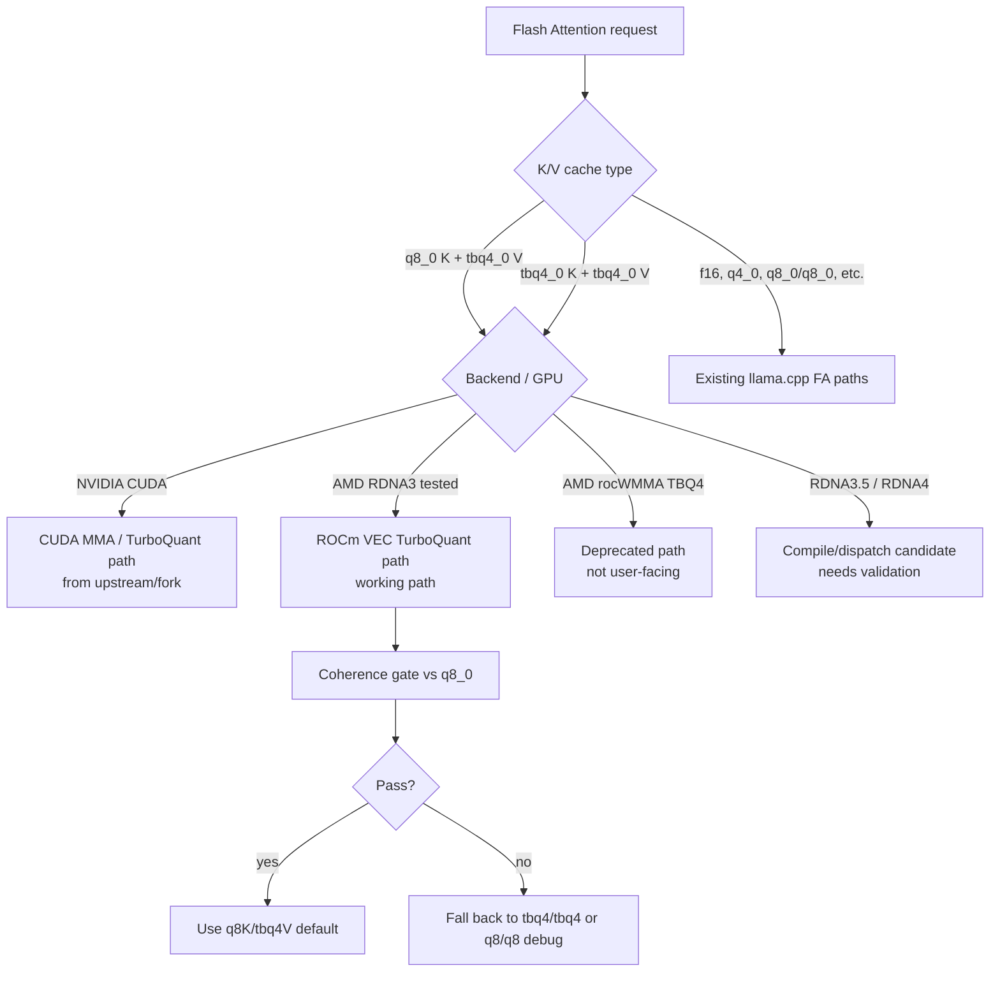

# llama.cpp ROCm + Vulkan TurboQuant KV Cache — Qwen3.6 27B MTP + 35B MoE on RX 7900 XTX

This branch targets AMD RDNA3 on an RX 7900 XTX (`gfx1100`) as a **2-in-1 ROCm + Vulkan build**: you can build ROCm-only, Vulkan-only, or one combined `build-rocm-vulkan` `llama-server` that exposes both `ROCm0` and `Vulkan0`, then choose the backend at runtime with `--device ROCm0` or `--device Vulkan0`.

> **2026-05-20 status update — fixes, speed, and the 35B MTP bug roadmap**
>
> - Runtime settings are aligned with the new speculative/MTP flags: `--spec-type draft-mtp --spec-default --spec-draft-p-min 0 --spec-draft-prio 2 --spec-draft-prio-batch 2`. Current starting points are `--spec-draft-n-max 3` for 27B ROCm/TBQ4 and `--spec-draft-n-max 2` for 35B A3B MTP.
> - 27B ROCm MTP now uses `LLAMA_MTP_PREFILL_CHUNK=1024`, `LLAMA_MTP_PREFILL_FORCE_MMQ=1`, and `GGML_CUDA_ROCM_QUANT_PREFILL_F16=1`; the f16 gate also enables stable temp allocation by default.
> - 35B no-MTP ROCm prompt processing keeps the MMQ selector path: build with `-DRDNA2_MATMUL_OPT_V1=1`, then run with `RDNA2_MATMUL_OPT_V1=1 GGML_CUDA_MMQ_MAX_X=48`.
> - 35B experimental ROCm MTP now has a validated f16-gate path at `ctx=40960`, `fill=32768`, `pp=1024`: f16 gate `1073 tok/s` fill and `1410 tok/s` cached pp1024 at `23.956 GiB` peak, versus no-f16 `574 tok/s` fill and `536 tok/s` cached pp1024.
> - Vulkan/RADV 35B MTP q8/q4 completed the same long-fill shape at `1941 tok/s` fill and `1116 tok/s` cached pp1024, proving the model and request shape are healthy.
> - Original upstream ROCm 35B f16/f16 no-MTP depth0 32k fill is also healthy at `2775 tok/s`; original ROCm quantized-KV (`q8_0/q4_0`) no-MTP 8k fill collapses to `232 tok/s` and decays with depth. This isolates the 35B MTP bug to the ROCm quantized-KV FlashAttention path, not to MTP alone.
>
> **Roadmap to fix the 35B ROCm MTP bug:** keep the f16-gate path as the safe experimental workaround; reduce the reproducer to no-MTP `q8_0/q4_0` / `q8_0/tbq4_0` ROCm prefill; instrument `launch_fattn`, `ggml_cuda_fattn_rocm_quant_prefill_f16_enabled`, and `ggml_cuda_fattn_f16_tmp_alloc_nelements`; diff the slow ROCm quantized FA route against healthy ROCm f16 FA and Vulkan q8/q4; then either repair the ROCm quantized FA depth scaling or formally promote bounded f16-temp prefill for 35B MTP. The fix gate is: no OOM, no request-time sleep, correct cache reuse, and 35B 32k-fill performance close to the Vulkan/f16 baselines.

The promoted ROCm path is **27B MTP long context** with the TurboQuant setting (`q8_0` K + `tbq4_0` V), plus a **35B MoE prompt-processing path** using the current best MMQ selector. Initial 35B long-fill probes now exist; the remaining work is the ROCm quantized-KV FlashAttention fix described above.

**Current default:** use `--cache-type-k q8_0 --cache-type-v tbq4_0` with VEC FlashAttention on ROCm. Keep `q8_0/tbq4_0` as the promoted ROCm TurboQuant setting. Do not generalize `q8_0/q4_0` as slow for every backend: Vulkan/RADV q8/q4 has been restored to upstream scalar/coopmat1 behavior and is healthy. The open bug is narrower: **35B ROCm long-fill with quantized KV** (`q8_0/q4_0` upstream and `q8_0/tbq4_0` here) scales pathologically versus ROCm f16/f16 and Vulkan q8/q4. Vulkan `q8_0/tbq4_0` still fails quality/perf gates and remains experimental. rocWMMA compressed-KV experiments are deprecated for now and should not be enabled in user-facing builds or wrappers. Short benchmark notes are kept near the bottom of this README.

The goal is simple:

- promote the best user-facing TurboQuant default: `--cache-type-k q8_0 --cache-type-v tbq4_0`,
- keep MTP/speculative decoding working,
- keep the default ROCm production Flash Attention route on the stable VEC path,
- keep the combined ROCm+Vulkan build obvious and selectable with `--device ROCm0` or `--device Vulkan0`,
- keep the 35B MoE prompt-processing selector build-gated with `-DRDNA2_MATMUL_OPT_V1=1` and runtime-gated with `RDNA2_MATMUL_OPT_V1=1 GGML_CUDA_MMQ_MAX_X=48`, usable with or without speculative MTP enabled,
- deprecate the rocWMMA compressed-KV prototype for now,
- keep `tbq4_0/tbq4_0` as the lowest-VRAM fallback when maximum context matters more than K quality/speed.

This is not a general "all AMD GPUs are supported" claim. The tested target is RDNA3 / RX 7900 XTX. RDNA3.5 and RDNA4 are compile/dispatch candidates, but still need real validation.

## Branch map

Structured from the upstream/fork README survey: **what works**, **what is deprecated**, **how to turn on the supported path**, and **what was actually tested**.

Read this branch like this:

| Area | What works here | What to expect |
|---|---|---|
| ROCm/HIP production path | Qwen3.6-27B MTP + `q8_0` K / `tbq4_0` V on RX 7900 XTX | Use `build-rocm`; default compressed-KV route stays VEC, not WMMA |
| MTP/speculative decoding | Qwen MTP works via upstream-style `--spec-type draft-mtp`; legacy `mtp` alias is still accepted; PR #23198 prefill fix included | Keep `--parallel 1`; use bounded draft length. ROCm/TBQ4 best observed: `n_max=3`; Vulkan q8/q4 best observed: `n_max=2` |
| TurboQuant-style KV usage | `--cache-type-k/--cache-type-v` is the user-facing contract, same as upstream/forks | Best ROCm default is `q8_0/tbq4_0`; `tbq4_0/tbq4_0` is the lower-VRAM fallback. Vulkan `q8_0/q4_0` is a restored baseline route; Vulkan `q8_0/tbq4_0` is not promoted |
| 35B MoE prefill | 35B path requires build `-DRDNA2_MATMUL_OPT_V1=1` plus runtime `RDNA2_MATMUL_OPT_V1=1 GGML_CUDA_MMQ_MAX_X=48` | Current best pp selector; applies to prompt processing whether speculative MTP is enabled or not |
| Vulkan | Vulkan build and device listing work; combined ROCm+Vulkan build also works | `q8_0/q4_0` mixed KV is restored to clean-baseline behavior on RADV; compressed-KV/TBQ4 Vulkan parity is **not** claimed yet |
| Deprecated/research kernels | rocWMMA compressed-KV variants are not a user path | Do not enable `TBQ4_WMMA_FATTN` / `COMPRESSED_KV_WMMA_FATTN` in production wrappers |

## Pick the path

| Need | Use | Status |
|---|---|---|
| 27B long context + MTP | `q8_0` K + `tbq4_0` V, `--spec-type draft-mtp --spec-default --spec-draft-n-max 3 --spec-draft-p-min 0`, MTP env below | Promoted default for user experience; use `tbq4_0/tbq4_0` only when you need the lowest VRAM / maximum context fallback |
| 35B MoE default | 35B IDs use a binary built with `-DRDNA2_MATMUL_OPT_V1=1` and runtime `RDNA2_MATMUL_OPT_V1=1 GGML_CUDA_MMQ_MAX_X=48`; speculative MTP optional | default llama-swap can use an MTP-capable model without enabling MTP |
| 35B MTP | same 35B MTP-capable model plus `--spec-type draft-mtp --spec-default --spec-draft-n-max 2 --spec-draft-p-min 0`, MTP env below, and `GGML_CUDA_ROCM_QUANT_PREFILL_F16=1` | experimental runtime mode; f16-gate path is the current workaround while the ROCm quantized-KV FA bug is debugged |
| Vulkan | `build-vulkan` or `--device Vulkan0` in combined build; for 35B MTP use `--cache-type-k q8_0 --cache-type-v q4_0 --spec-draft-n-max 2` | q8/q4 mixed KV baseline is restored; TBQ4 Vulkan parity is not claimed |

**Do not mix up the env groups:** ROCm MTP routes use `LLAMA_MTP_PREFILL_CHUNK=1024 LLAMA_MTP_PREFILL_FORCE_MMQ=1` and `LLAMA_MTP_PREFILL_CHUNK` must match `--ubatch-size`; current 27B MTP and explicit 35B MTP experiments also use `GGML_CUDA_ROCM_QUANT_PREFILL_F16=1`. The `RDNA2_MATMUL_OPT_V1=1 GGML_CUDA_MMQ_MAX_X=48` pair is the 35B MoE prompt-processing selector; it also requires a binary built with `-DRDNA2_MATMUL_OPT_V1=1`, and it is not a substitute for the MTP prefill allocator workaround. The Vulkan q8/q4 MTP baseline below does not use the ROCm MTP prefill env pair.

## Current ROCm runtime summary

Use this README as runtime guidance first; detailed result notes are intentionally moved near the bottom.

| Need | Use | Notes |
|---|---|---|
| Best default user experience | `--cache-type-k q8_0 --cache-type-v tbq4_0` | Promoted TurboQuant setting: keep K fidelity/speed, compress V |
| Lowest VRAM / maximum context fallback | `--cache-type-k tbq4_0 --cache-type-v tbq4_0` | Still useful when context fit matters more than K quality/speed |
| `q8_0/q4_0` ROCm status | `--cache-type-k q8_0 --cache-type-v q4_0` | Not promoted over `q8_0/tbq4_0`. Original ROCm 35B long-fill shows the same quantized-KV FA pathology, while Vulkan q8/q4 is healthy and remains the mixed-KV baseline route. |
| 3-bit Planar/Iso formats | `planar3_0`, `iso3_0` | Registered and gated, but not promoted as defaults; use only for max-compression experiments |
| 27B MTP | `--spec-type draft-mtp --spec-default --spec-draft-n-max 3 --spec-draft-p-min 0 --parallel 1` plus `--batch-size 1024 --ubatch-size 1024`, `LLAMA_MTP_PREFILL_CHUNK=1024 LLAMA_MTP_PREFILL_FORCE_MMQ=1`, and `GGML_CUDA_ROCM_QUANT_PREFILL_F16=1` | Current ROCm/MTP server setting; f16 stable allocation is automatic when the f16 gate is on; 2048 is safe but not promoted |
| 35B MoE prompt-processing | build with `-DCMAKE_HIP_FLAGS="-DRDNA2_MATMUL_OPT_V1=1"`, then run with `RDNA2_MATMUL_OPT_V1=1 GGML_CUDA_MMQ_MAX_X=48` | Works on the MTP-capable 35B model; MTP is a runtime mode, not a different selector |
| 35B experimental MTP | add `--spec-type draft-mtp --spec-default --spec-draft-n-max 2 --spec-draft-p-min 0`, `LLAMA_MTP_PREFILL_CHUNK=1024 LLAMA_MTP_PREFILL_FORCE_MMQ=1`, and `GGML_CUDA_ROCM_QUANT_PREFILL_F16=1` | Validated workaround for 32k long-fill; underlying ROCm quantized-KV FA depth-scaling bug remains open |
| rocWMMA compressed-KV | Do not enable | Deprecated for now; VEC FlashAttention is the production path |

Use `--flash-attn on` for quantized V cache. The production ROCm compressed-KV path is VEC FlashAttention. Vulkan `q8_0/q4_0` is a restored baseline route; Vulkan `q8_0/tbq4_0` is still not promoted. `TBQ4_WMMA_FATTN` and `COMPRESSED_KV_WMMA_FATTN` are not recommended toggles.

## What changed

| Area | Status | Notes |
|---|---|---|
| TurboQuant VEC Flash Attention | Working | Production path for `q8_0/tbq4_0` and fallback `tbq4_0/tbq4_0`; dequant happens inside the FA loop |
| Vulkan `q8_0/q4_0` KV | Restored baseline route | Isolated onto upstream FA scalar+coopmat1 sources so TBQ4/TQ3 shader mutations do not leak into default q8/q4. 35B 8k+2k run: clean 2193.6 pp / 133.3 tg / 94.1% accept; branch 2193.8 pp / 129.4 tg / 94.1% accept |
| MTP speculative decoding | Working | Use `--spec-type draft-mtp --spec-default`; old `mtp` alias still works. ROCm/TBQ4 27B stays at `--spec-draft-n-max 3`; start 35B A3B MTP at `--spec-draft-n-max 2`; use `--spec-draft-p-min 0` to avoid graph-size churn from variable draft lengths. |
| MTP prefill allocator stability | Working | `LLAMA_MTP_PREFILL_CHUNK=1024` plus `LLAMA_MTP_PREFILL_FORCE_MMQ=1` avoids the draft-prefill matmul temp spike; stable f16 temp allocation is automatic when `GGML_CUDA_ROCM_QUANT_PREFILL_F16=1` |
| MTP prompt-decode speed | Improved | PR #23198 avoids full-logit copies during MTP prompt decode; 35B n3 prefill improved 1376.82 → 1927.00 tok/s, 27B n3 506.34 → 632.04 tok/s in the 8K sweep |
| MTP server shutdown | Fixed | Speculative state is released before the target context/model, so MTP detach no longer double-frees |
| Coherence gate | Passing | q8K/tbq4V and TBQ4 fallback compared against `q8_0` next-token distributions |
| rocWMMA compressed-KV | Deprecated for now | Built during investigation, but not a correct/user-facing path; do not enable in wrappers |
| RotorQuant / `tbq4_0` | Production-smoked on gfx1100 | 32k/64k TBQ4+MTP server smokes pass cleanly |
| PlanarQuant / IsoQuant (`planar3_0`, `iso3_0`) | Fixed and gated | 3-bit original-domain formats; covered by Triton oracle + invariant gates; not default user path |
| 35B MoE MMQ selector | Working, compile+env gated | Build with `-DCMAKE_HIP_FLAGS="-DRDNA2_MATMUL_OPT_V1=1"`, then run with `RDNA2_MATMUL_OPT_V1=1 GGML_CUDA_MMQ_MAX_X=48`; use it for 35B with or without `--spec-type draft-mtp` |
| Vulkan backend | Builds/list-devices; q8/q4 restored | Separate `build-vulkan` and combined `build-rocm-vulkan` verified. Vulkan q8/q4 mixed KV matches clean baseline; TBQ4/Planar/Iso Vulkan parity is not claimed |

## Why rocWMMA is deprecated for now

The first ROCm TBQ4 attempt used rocWMMA. It was stable enough to run, but the output was wrong, so it is deprecated for now rather than exposed as an experiment users might accidentally enable.

The working path is the simpler VEC Flash Attention path — the same approach [Stormrage34/llama.cpp-turboquant-hip](https://github.com/Stormrage34/llama.cpp-turboquant-hip) first validated for AMD (`turbo2/3/4` types), adapted here for mixed `q8_0` K + `tbq4_0` V and the pure `tbq4_0/tbq4_0` fallback:

1. keep the recommended K cache at `q8_0`,
2. dequantize compressed V inside the attention loop,
3. keep the pure TBQ4 fallback for lowest-VRAM context fit,
4. validate output against `q8_0` baselines.

That path is slower than a mature native matrix-core implementation could be, but it is the correct, validated path to use and debug today.

### TurboQuant VEC Flash Attention path



The promoted route keeps K at `q8_0` and compresses V as `tbq4_0`. TBQ4 V is not first expanded globally; dequant happens inside the attention path.

### Dispatch decision



This separates working, deprecated, and untested instead of blending them together.

## Build (ROCm, Vulkan, or ROCm+Vulkan / RX 7900 XTX)

### Prerequisites

- ROCm 7.2.3+ (tested: `/opt/rocm-7.2.3`)
- HIP compiler: `/opt/rocm-7.2.3/bin/amdclang++`
- Vulkan/RADV runtime for Vulkan builds
- GPU: RDNA3 (`gfx1100`/`gfx1101`/`gfx1102`/`gfx1103`)
- Model: Qwen3.6 MTP GGUF (see below)

### Build: choose one binary shape

All three build shapes use the same branch and source tree. Pick the one that matches what you want to test:

- `build-rocm`: ROCm/HIP production path for TurboQuant-style KV and 35B MoE prompt processing.
- `build-vulkan`: Vulkan backend/device smoke path. The mixed `q8_0/q4_0` baseline route is restored; compressed-KV/TBQ4 Vulkan parity is **not** claimed.
- `build-rocm-vulkan`: 2-in-1 binary that can expose both `ROCm0` and `Vulkan0`; choose the active backend at runtime with `--device`.

```bash
git clone https://github.com/DrBearJew/llama.cpp.git
cd llama.cpp
git checkout tbq4-rdna3-experiment

# ROCm/HIP production build
cmake -B build-rocm -DGGML_HIP=ON \
  -DAMDGPU_TARGETS=gfx1100 \
  -DCMAKE_HIP_COMPILER=/opt/rocm-7.2.3/bin/amdclang++ \
  -DCMAKE_HIP_FLAGS="-DRDNA2_MATMUL_OPT_V1=1" \
  -DCMAKE_BUILD_TYPE=Release
cmake --build build-rocm --target llama-server -j8

# Vulkan-only backend check
cmake -B build-vulkan -DGGML_VULKAN=ON -DGGML_HIP=OFF -DCMAKE_BUILD_TYPE=Release
cmake --build build-vulkan --target llama-server -j8

# Combined ROCm+Vulkan 2-in-1 build
cmake -B build-rocm-vulkan \
  -DGGML_HIP=ON -DGGML_VULKAN=ON \
  -DAMDGPU_TARGETS=gfx1100 \
  -DCMAKE_HIP_COMPILER=/opt/rocm-7.2.3/bin/amdclang++ \
  -DCMAKE_HIP_FLAGS="-DRDNA2_MATMUL_OPT_V1=1" \
  -DCMAKE_BUILD_TYPE=Release
cmake --build build-rocm-vulkan --target llama-server -j8
```

Do **not** rebuild per model, and do **not** set model-route env at CMake time; those are runtime settings.

The `-DRDNA2_MATMUL_OPT_V1=1` HIP compile flag only makes the RDNA2/RDNA3 MMQ selector code available. You still must set runtime `RDNA2_MATMUL_OPT_V1=1` to enable that path; if the binary is built without the compile flag, the runtime env is ignored.

### Run: ROCm routes

Use `./build-rocm/bin/llama-server` for ROCm-only builds. If you built the combined binary, use `./build-rocm-vulkan/bin/llama-server --device ROCm0` instead.

Set env per server entry or wrapper at runtime. Current ROCm MTP examples use `--batch-size 1024 --ubatch-size 1024` to match `LLAMA_MTP_PREFILL_CHUNK=1024`; the 35B no-MTP example keeps `--batch-size 1024 --ubatch-size 512` for prompt processing.

| Route | Runtime env to set |
|---|---|
| 27B MTP | `LLAMA_MTP_PREFILL_CHUNK=1024 LLAMA_MTP_PREFILL_FORCE_MMQ=1 GGML_CUDA_ROCM_QUANT_PREFILL_F16=1` |
| 35B MoE prompt-processing / non-MTP | build-time `-DRDNA2_MATMUL_OPT_V1=1`; runtime `RDNA2_MATMUL_OPT_V1=1 GGML_CUDA_MMQ_MAX_X=48` |
| 35B MoE with MTP enabled | build-time `-DRDNA2_MATMUL_OPT_V1=1`; runtime `RDNA2_MATMUL_OPT_V1=1 GGML_CUDA_MMQ_MAX_X=48 LLAMA_MTP_PREFILL_CHUNK=1024 LLAMA_MTP_PREFILL_FORCE_MMQ=1 GGML_CUDA_ROCM_QUANT_PREFILL_F16=1` |

`GGML_CUDA_ROCM_QUANT_PREFILL_F16=1` automatically uses the default 1024 MiB cap and stable f16 temp allocation. Only set the longer `*_MAX_MIB`, `*_STABLE_ALLOC`, or `*_STABLE_NKV` knobs when debugging or overriding defaults. Keep the f16 gate off 35B no-MTP wrappers; use it for explicit 35B MTP experiments after the 32K fill artifact below.

```bash
# 27B MTP current recommended ROCm path: q8 K + TBQ4 V, f16 prefill
LLAMA_MTP_PREFILL_CHUNK=1024 \
LLAMA_MTP_PREFILL_FORCE_MMQ=1 \
GGML_CUDA_ROCM_QUANT_PREFILL_F16=1 \
./build-rocm/bin/llama-server \
  -m /path/to/Qwen3.6-27B-Q4_K_M-mtp.gguf \
  --cache-type-k q8_0 --cache-type-v tbq4_0 \
  --flash-attn on \
  --batch-size 1024 --ubatch-size 1024 --cache-ram 128 \
  --spec-type draft-mtp --spec-default \
  --spec-draft-n-max 3 --spec-draft-p-min 0 \
  --spec-draft-prio 2 --spec-draft-prio-batch 2 \
  --parallel 1 \
  --jinja --chat-template-file docs/rocm-tbq4-paths/qwen36-merged-template.jinja \
  -c 40960 --port 8080 --no-webui --no-warmup

# 35B MoE default: prompt-processing selector, MTP disabled
RDNA2_MATMUL_OPT_V1=1 \
GGML_CUDA_MMQ_MAX_X=48 \
./build-rocm/bin/llama-server \
  -m /path/to/Qwen3.6-35B-A3B-Q4_K_M.gguf \
  --cache-type-k q8_0 --cache-type-v tbq4_0 \
  --flash-attn on \
  --batch-size 1024 --ubatch-size 512 --cache-ram 128 \
  --jinja --chat-template-file docs/rocm-tbq4-paths/qwen36-merged-template.jinja \
  -c 32768 --port 8080 --no-webui --no-warmup --parallel 1

# 35B MoE with explicit MTP enabled: combine the MoE selector with the MTP prefill env
RDNA2_MATMUL_OPT_V1=1 \
GGML_CUDA_MMQ_MAX_X=48 \
LLAMA_MTP_PREFILL_CHUNK=1024 \
LLAMA_MTP_PREFILL_FORCE_MMQ=1 \
GGML_CUDA_ROCM_QUANT_PREFILL_F16=1 \
./build-rocm/bin/llama-server \
  -m /path/to/Qwen3.6-35B-A3B-MTP-Q4_K_M.gguf \
  --cache-type-k q8_0 --cache-type-v tbq4_0 \
  --flash-attn on \
  --batch-size 1024 --ubatch-size 1024 --cache-ram 128 \
  --spec-type draft-mtp --spec-default \
  --spec-draft-n-max 2 --spec-draft-p-min 0 \
  --spec-draft-prio 2 --spec-draft-prio-batch 2 \
  --jinja --chat-template-file docs/rocm-tbq4-paths/qwen36-merged-template.jinja \
  -c 32768 --port 8080 --no-webui --no-warmup --parallel 1
```

### Run: Vulkan or combined backend checks

Vulkan is useful as a backend check and for the restored mixed `q8_0/q4_0` baseline route. Compressed-KV/TBQ4 Vulkan parity is **not** claimed yet in this experiment branch.

On RDNA3/RADV, the Vulkan start environment is part of the benchmark contract. Always start Vulkan with `RADV_PERFTEST=nogttspill`; otherwise generation can look ~3x slower even when the model, KV cache, and MTP settings are unchanged. This is not a `SET_ROWS` regression. Do not use `LLAMA_SET_ROWS` as a control flag; it is not a Vulkan runtime switch here.

Recommended Vulkan start parameters for RDNA3/RADV:

| Parameter | Value | Why |
|---|---|---|
| `VK_ICD_FILENAMES` | `/usr/share/vulkan/icd.d/radeon_icd.json` | Select RADV explicitly on systems with multiple Vulkan ICDs |
| `RADV_PERFTEST` | `nogttspill` | Avoid RADV GTT spill behavior that can crater generation speed |
| `LD_LIBRARY_PATH` | `$PWD/build-vulkan/bin:...` | Load the matching local llama/ggml Vulkan libraries |
| KV cache | `--cache-type-k q8_0 --cache-type-v q4_0` | Restored mixed-KV Vulkan baseline route |
| MTP | `--spec-type draft-mtp --spec-default --spec-draft-n-max 2 --spec-draft-p-min 0 --spec-draft-prio 2 --spec-draft-prio-batch 2` | Best observed Vulkan q8/q4 MTP setting plus current PR #23269 experimental defaults |
| Prompt cache | `--cache-ram 128` | Keeps prompt-cache accounting bounded in long-run comparisons |

```bash
# Vulkan-only: check device name; expect Vulkan0 on this box
LD_LIBRARY_PATH=$PWD/build-vulkan/bin \
  ./build-vulkan/bin/llama-server --list-devices

# Vulkan-only: start a small server smoke
MODEL=/path/to/model.gguf
LD_LIBRARY_PATH=$PWD/build-vulkan/bin \
  ./build-vulkan/bin/llama-server \
  -m "$MODEL" --device Vulkan0 \
  --ctx-size 4096 --host 127.0.0.1 --port 8080 \
  --no-webui --no-warmup -ngl 99

# Vulkan q8/q4 35B MTP baseline (RADV): restored mixed-KV path; best observed n_max=2
RADV_PERFTEST=nogttspill \
LD_LIBRARY_PATH=$PWD/build-vulkan/bin:${LD_LIBRARY_PATH:-} \
  ./build-vulkan/bin/llama-server \
  -m /path/to/Qwen3.6-35B-A3B-MTP-Q4_K_M.gguf --device Vulkan0 \
  --ctx-size 10000 --flash-attn on \
  --cache-type-k q8_0 --cache-type-v q4_0 \
  --spec-type draft-mtp --spec-default --spec-draft-n-max 2 --spec-draft-p-min 0 \
  --spec-draft-prio 2 --spec-draft-prio-batch 2 \
  --spec-draft-type-k q8_0 --spec-draft-type-v q4_0 \
  --batch-size 512 --ubatch-size 512 --cache-ram 128 \
  --parallel 1 --no-webui --no-warmup

# Combined build: list devices; expect both ROCm0 and Vulkan0 when both backends load
LD_LIBRARY_PATH=$PWD/build-rocm-vulkan/bin:/opt/rocm-7.2.3/lib:/opt/amdgpu/lib/x86_64-linux-gnu:${LD_LIBRARY_PATH:-} \
  ./build-rocm-vulkan/bin/llama-server --list-devices

# Combined build: pick Vulkan explicitly
LD_LIBRARY_PATH=$PWD/build-rocm-vulkan/bin:/opt/rocm-7.2.3/lib:/opt/amdgpu/lib/x86_64-linux-gnu:${LD_LIBRARY_PATH:-} \
  ./build-rocm-vulkan/bin/llama-server \
  -m "$MODEL" --device Vulkan0 \
  --ctx-size 4096 --no-webui --no-warmup -ngl 99

# Combined build: pick ROCm/HIP explicitly
LD_LIBRARY_PATH=$PWD/build-rocm-vulkan/bin:/opt/rocm-7.2.3/lib:/opt/amdgpu/lib/x86_64-linux-gnu:${LD_LIBRARY_PATH:-} \
  ./build-rocm-vulkan/bin/llama-server \
  -m "$MODEL" --device ROCm0 \
  --cache-type-k q8_0 --cache-type-v tbq4_0 \
  --flash-attn on --ctx-size 4096 --no-webui --no-warmup -ngl 99
```

Docker helper:

```bash
scripts/vulkan/start-vulkan-docker-server.sh --list-devices
PORT=8080 CTX_SIZE=4096 scripts/vulkan/start-vulkan-docker-server.sh /path/to/model.gguf --no-warmup
```

### Quick toggles: experiments

Keep production boring. Flip these only when testing:

| Want | Toggle / command | Note |
|---|---|---|
| 27B / explicit 35B MTP stability | `LLAMA_MTP_PREFILL_CHUNK=1024 LLAMA_MTP_PREFILL_FORCE_MMQ=1` | Required for current ROCm MTP route; pair with `--spec-type draft-mtp --parallel 1` and `--ubatch-size 1024`; default ROCm KV is `q8_0/tbq4_0` |
| ROCm quantized-KV f16 prefill | `GGML_CUDA_ROCM_QUANT_PREFILL_F16=1` | Single opt-in for the faster f16 FA route; cap and stable allocation use safe defaults |
| PR #23269 chained speculation | `--spec-default --spec-draft-p-min 0 --spec-draft-prio 2 --spec-draft-prio-batch 2` | `--spec-default` adds the default ngram-mod chain; `p-min=0` avoids graph churn noted in the PR comments |
| 35B MoE prefill boost | build with `-DRDNA2_MATMUL_OPT_V1=1`, run with `RDNA2_MATMUL_OPT_V1=1 GGML_CUDA_MMQ_MAX_X=48` | Best current 35B prompt-processing setting; not the MTP OOM workaround |
| Vulkan/RADV start parameters | `VK_ICD_FILENAMES=/usr/share/vulkan/icd.d/radeon_icd.json RADV_PERFTEST=nogttspill` | Required for credible Vulkan speed checks on RDNA3; omitting `nogttspill` can make generation look much slower |
| TBQ4 local experiment pair | `TBQ4_COOP_SET_ROWS=1 TBQ4_LAYER_ADAPTIVE=7` | Best current fixed-seed 8K MTP ablation pair; use for TBQ4 probes, not required for baseline correctness |
| TBQ4 vec norm hoist probe | `GGML_CUDA_TBQ4_VEC_NORM_HOIST=1` | Probe only; single-run looked good, fixed-seed combo was worse than leaving it unset |
| TBQ4 LDS route probe | `GGML_CUDA_TBQ4_LDS_ROUTE=D_K` | Probe only; not promoted |
| TBQ4 inner-Q probe | `TBQ4_INNERQ=256` | Probe only; not promoted |
| Sparse-V probe | `GGML_CUDA_SPARSE_V_DEQUANT=1` | Optional/default-off; short 8K probe was near-neutral |
| Sparse-V tau probe | `GGML_CUDA_SPARSE_V_TAU_LEVEL=3` | Only meaningful with sparse-V enabled; tau alone is invalid/misleading |
| Deprecated rocWMMA FA | `TBQ4_WMMA_FATTN=1`, `COMPRESSED_KV_WMMA_FATTN=1` | Do not use for now; VEC is the production path |
| Compressed-KV FA logging | `COMPRESSED_KV_FATTN_LOG=1` | Diagnostic logging only; not a performance setting |
| IQ4_XS scratch MMQ | `RDNA2_MATMUL_OPT_V1=1 GGML_CUDA_IQ4_XS_MMQ_SCRATCH16K=1` | Coherent, but slower so far |

### Chat template (Qwen 3.6)

Use the merged template included in this repo (`docs/rocm-tbq4-paths/qwen36-merged-template.jinja`).
It supports `<|think_off|>`, developer role, and tool calls.

Source repos:
- [allanchan339/vLLM-Qwen3-Chat-Template-Fix](https://github.com/allanchan339/vLLM-Qwen3-3.5-3.6-chat-template-fix)
- [froggeric/Qwen-Fixed-Chat-Templates](https://huggingface.co/froggeric/Qwen-Fixed-Chat-Templates)

## MTP finding

The llama.cpp server default for `--spec-draft-n-max` is 16. On this setup, that was too aggressive and lowered aggregate acceptance.

For the ROCm/TBQ4 model/backend path, `--spec-draft-n-max 3` gave the best observed result. The old short-run acceptance check was:

| KV cache | `n_max` | Drafted | Accepted | Accept rate | Speed |
|---|---:|---:|---:|---:|---:|
| `q8_0` | 3 | 57 | 44 | 77.2% | 49.8 tok/s |
| `tbq4_0` | 3 | 54 | 45 | 83.3% | 54.0 tok/s |
| `tbq4_0` | 16 | 144 | 53 | 36.8% | 38.1 tok/s |

The current post-PR #23198 ROCm/TBQ4 8K sweep keeps the same conclusion for that path: `n_max=3` is still the best overall setting, and the MTP prefill penalty is now much smaller.

PR #23269 adds chained speculative decoding defaults via `--spec-default` (currently ngram-mod with match/min/max defaults of 24/48/64). Use it together with MTP for interactive/server runs. Also set `--spec-draft-p-min 0`; PR discussion found `p-min > 0` can create variable graph sizes and regress speed. For 35B A3B MTP, start with `--spec-draft-n-max 2` from the PR discussion; for 27B ROCm/TBQ4, keep `--spec-draft-n-max 3` until a new sweep says otherwise.

| Model | Mode | Prompt tok/s | Decode tok/s | Accepted | vs no-MTP decode |
|---|---|---:|---:|---:|---:|
| 35B MoE | no MTP | 2240.20 | 75.11 | - | baseline |
| 35B MoE | MTP `n_max=3` | 1927.00 | 101.67 | 81/135 | +35.4% |
| 27B | no MTP | 682.84 | 26.10 | - | baseline |
| 27B | MTP `n_max=3` | 632.04 | 47.26 | 90/110 | +81.1% |

### Vulkan q8/q4 MTP n_max sweep

The restored Vulkan q8/q4 mixed-KV route was swept separately on 35B with 8k prompt + 2k generation, `--cache-type-k q8_0 --cache-type-v q4_0`, and draft cache also q8/q4. This is **not** a TBQ4 Vulkan promotion; it is the upstream-compatible q8/q4 baseline route.

| `n_max` | Prompt tok/s | Decode tok/s | Accepted/generated | Acceptance |
|---:|---:|---:|---:|---:|
| 2 | 2198.7 | **129.7** | 1305/1387 | **94.1%** |
| 3 | 2073.1 | 118.7 | 1431/1702 | 84.1% |
| 4 | 2184.8 | 107.0 | 1419/2320 | 61.2% |
| 5 | 2051.7 | 105.8 | 1547/2257 | 68.5% |
| 6 | 2051.3 | 117.6 | 1632/2197 | 74.3% |
| 7 | 2106.6 | 110.3 | 1642/2495 | 65.8% |

At ctx 10240, target q8/q4 KV was 81.25 MiB (K 53.12 MiB, V 28.12 MiB) and the MTP draft q8/q4 KV was 8.12 MiB (K 5.31 MiB, V 2.81 MiB). Recurrent-state memory grows by about 62.8 MiB per `n_max` step on this 35B MTP setup.

For the ROCm/TBQ4 results, this does not prove TBQ4 improves MTP acceptance. It shows that, **in those tested runs**, TBQ4 did not damage acceptance compared with `q8_0`, and PR #23198 removes most of the old MTP prompt-fill slowdown.

## Validation

The coherence gate compares TBQ4 against a `q8_0` KV baseline. It does not compare against FP16 or FP32 — `q8_0` is itself quantized.

Quick-mode result (4k context):

| Layer | Result | Notes |
|---|---|---|
| Smoke | PASS | Basic deterministic prompts |
| Precision | PASS | 100% top-1 match, 0.945 Jaccard, 0.0017 JSD vs `q8_0` |
| Canaries | PASS | JSON, ChatML leak guard, tool-call schema, code syntax |
| MTP | PASS | 83.3% acceptance in the tested run |
| Cache | PASS | Same output with and without `cache_prompt` |

This is a practical correctness gate, not a proof of mathematical losslessness.

Compressed-KV prototype/gate coverage also includes `planar3_0` and `iso3_0`:

| Gate | Formats | Result |
|---|---|---|
| `experiments/compressed_kv_triton/run_all.sh` | `planar3_0`, `iso3_0`, `tbq4_0` | PASS |
| `run_all_json.py` | `planar3_0`, `iso3_0`, `tbq4_0` | PASS 20/20 |
| `scripts/hip/check-compressed-kv-fa-invariants.sh` | production dispatch/gating | PASS |

The long-context production server smokes are TBQ4-focused. Planar/Iso are fixed and covered by the compressed-KV gates, but their rocWMMA route is deprecated for now rather than opt-in production guidance.

### Run the gate

```bash
cd docs/rocm-tbq4-paths

# Quick mode (< 5 min, 4k ctx)
python3 harness.py --quick

# Full gate (64k ctx, needle retrieval, long prompts)
python3 harness.py --tbq4-ctx 65536 --q8-ctx 16384
```

Results are written to `gate-summary.json`.


## Key files changed

| File | Purpose |
|---|---|
| `ggml/src/ggml-cuda/fattn-common.cuh` | `vec_dot_fattn_vec_KQ_tbq4_0`, `dequantize_V_tbq4_0` |
| `ggml/src/ggml-cuda/fattn-vec.cuh` | `DECL_FATTN_VEC_CASE` for TBQ4 D=64/128/256 |
| `ggml/src/ggml-cuda/fattn.cu` | Routes AMD RDNA targets to the VEC TurboQuant path |
| `ggml/src/ggml-cuda/mmq.cu` | Env-gated MTP prefill MMQ routing for supported quantized matmuls |
| `ggml/src/ggml-cuda/mmq.cuh` | 256-thread MMQ workgroup cleanup plus `GGML_CUDA_MMQ_MAX_X` selector cap |
| `src/llama-context.cpp` | MTP prefill chunking and safer hook-batch storage |
| `src/llama-mtp.h` | Vector-backed hook batch storage |
| `tools/server/server-context.cpp` | Releases speculative MTP state before freeing the target context |
| `src/llama-kv-cache.cpp` | Disables generic `attn_rot_*` for TBQ4 |
| `ggml/src/ggml-vulkan/vulkan-shaders/flash_attn_q8_q4_upstream*.comp` | Keeps default Vulkan q8/q4 on upstream scalar+coopmat1 FA sources |
| `ggml/src/ggml-vulkan/vulkan-shaders/flash_attn_q8_tbq4_vec.comp` | Dedicated experimental Vulkan q8/tbq4 path; not promoted |
| `ggml/src/ggml-cuda/fattn-wmma-tbq4.cu` | Deprecated rocWMMA prototype (not user-facing) |

### Bugs fixed

1. **VEC correctness**: `dequantize_V_tbq4_0` used wrong index; TBQ4 was double-rotated via generic Hadamard
2. **VEC prefill speed**: TBQ4 KQ dot used f16-style `Q_reg` but RDNA quantized lane mapping → fixed with `KQ_uses_Q_reg` + `nthreads_KQ=8`
3. **Rotation model**: TBQ4 stores K/V in signed-FWHT domain; Q pre-rotated, output inverse-rotated
4. **MTP request-time OOM**: draft-prefill hipBLAS temp allocation could request multi-GiB buffers; supported quantized MTP prefill matmuls can be routed through MMQ with `LLAMA_MTP_PREFILL_FORCE_MMQ=1`
5. **MTP shutdown double-free**: server cleanup freed the target context before speculative MTP state detached from it; speculative state now resets first
6. **MTP prompt-decode logits copy**: upstream PR #23198 avoids copying full logits for every prompt token when MTP only needs pre-norm embeddings; this fixes most of the old 8K MTP prefill slowdown
7. **Vulkan q8/q4 regression**: default Vulkan `q8_0/q4_0` now uses upstream scalar+coopmat1 FA sources, preventing experimental TBQ4/TQ3 shader changes from leaking into the mixed-KV baseline

## GPU architecture status

Emphasis: "enabled" means the code dispatches, not that the path has been tested.

| Family | Targets | Status |
|---|---|---|
| RDNA3 | gfx1100/1101/1102/1103 | **Tested on gfx1100** — VEC FA + MTP verified |
| RDNA3.5 | gfx1150/1151/1152 | Dispatch candidate — same VEC path, **untested** |
| RDNA4 | gfx1200/1201+ | Dispatch candidate — `amd_wmma_available()` gate enabled, **untested** |
| RDNA1/RDNA2 | gfx10xx | Not routed to TBQ4 VEC |
| CDNA/MI* | gfx9x/gfx94x | Not routed |
| NVIDIA | sm_80/sm_89/sm_90 | Existing CUDA MMA TBQ4 path from upstream |

Validation steps for a new GPU family:

1. build with `AMDGPU_TARGETS=<gfx>`,
2. run smoke + precision probes (harness quick mode),
3. run at least 8k and 32k needle tests,
4. run MTP acceptance test,
5. record VRAM and throughput separately from correctness.

## Getting an MTP-capable GGUF

**Option A — Pre-built (recommended)**

```bash
# llmfan46's pre-built GGUF with 15 native MTP heads (~17 GB, Q4_K_M)
wget https://huggingface.co/llmfan46/Qwen3.6-27B-uncensored-heretic-v2-Native-MTP-Preserved-GGUF/resolve/main/Qwen3.6-27B-uncensored-heretic-v2-Native-MTP-Preserved-Q4_K_M.gguf
```

**Option B — Graft MTP heads onto any Qwen3.6 GGUF**

```bash
wget https://huggingface.co/havenoammo/Qwen3.6-27B-MTP-UD-GGUF/resolve/main/MTP-Q8_0.gguf
uv pip install gguf
python convert.py base-model.gguf MTP-Q8_0.gguf output-mtp.gguf
```

## Key flags

| Flag | Purpose |
|---|---|
| `--cache-type-k q8_0 --cache-type-v tbq4_0` | Recommended TurboQuant KV default: q8 K fidelity/speed with compressed TBQ4 V |
| `--cache-type-k tbq4_0 --cache-type-v tbq4_0` | Lowest-VRAM fallback for maximum context fit |
| `--cache-type-k q8_0 --cache-type-v q8_0` | Diagnostic/reference KV cache (highest VRAM) |
| `--flash-attn on` | Required for quantized V cache |
| `--batch-size 1024 --ubatch-size 1024` | Current MTP+TurboQuant server batch settings; matches `LLAMA_MTP_PREFILL_CHUNK=1024` |
| `--cache-ram 128` | Keeps host-side prompt/cache reuse bounded in the tested server setup |
| `--spec-type draft-mtp --spec-default` | MTP plus the PR #23269 default ngram-mod chain; `mtp` alias still works but prefer the explicit name |
| `--spec-draft-n-max 3` | Current 27B ROCm/TBQ4 setting |
| `--spec-draft-n-max 2` | 35B A3B MTP starting point from the PR #23269 discussion; retest before promoting for every backend/KV shape |
| `--spec-draft-p-min 0` | Recommended with the new MTP chain to avoid variable draft-size graph churn from `p-min > 0` |
| `--spec-draft-prio 2 --spec-draft-prio-batch 2` | Optional high-priority draft worker settings used in the PR #23269 recommended config |
| `LLAMA_MTP_PREFILL_CHUNK=1024` | Chunks target hidden-state transfer into draft-prefill decode calls; must match `--ubatch-size` |
| `LLAMA_MTP_PREFILL_FORCE_MMQ=1` | Env-gated workaround for MTP draft-prefill hipBLAS/ROCm temp allocation OOM |
| `GGML_CUDA_ROCM_QUANT_PREFILL_F16=1` | Opt-in f16-temp FlashAttention prefill route for quantized K/V on ROCm; enables stable f16 temp allocation by default |
| `GGML_CUDA_ROCM_QUANT_PREFILL_F16_MAX_MIB=1024` | Optional override; per-op f16 temp cap defaults to 1024 MiB |
| `GGML_CUDA_ROCM_QUANT_PREFILL_F16_STABLE_ALLOC=0/1` | Optional override; stable allocation defaults on when `GGML_CUDA_ROCM_QUANT_PREFILL_F16=1` |
| `GGML_CUDA_ROCM_QUANT_PREFILL_F16_STABLE_NKV=40960` | Optional override; stable `nkv` auto-detects from the full KV view when unset |
| `--jinja --chat-template-file <path>` | Qwen merged chat template |
| `--parallel 1` | Required for MTP |
| build `-DCMAKE_HIP_FLAGS="-DRDNA2_MATMUL_OPT_V1=1"` + runtime `RDNA2_MATMUL_OPT_V1=1 GGML_CUDA_MMQ_MAX_X=48` | Best current Qwen3.6-35B-A3B prompt-processing selector; compatible with MTP-capable models, but MTP still needs the `LLAMA_MTP_PREFILL_*` pair |
| `TBQ4_COOP_SET_ROWS=1 TBQ4_LAYER_ADAPTIVE=7` | Preferred local TBQ4 experiment pair from fixed-seed 8K MTP ablation; keep separate from baseline/runtime-required flags |
| `GGML_CUDA_TBQ4_VEC_NORM_HOIST=1` | TBQ4 probe only; leave unset unless explicitly testing |
| `GGML_CUDA_TBQ4_LDS_ROUTE=D_K` | TBQ4 probe only; leave unset unless explicitly testing |
| `TBQ4_INNERQ=256` | TBQ4 probe only; leave unset unless explicitly testing |
| `GGML_CUDA_SPARSE_V_DEQUANT=1` | Optional sparse-V dequant probe; default-off |
| `GGML_CUDA_SPARSE_V_TAU_LEVEL=3` | Sparse-V tau probe; use only together with `GGML_CUDA_SPARSE_V_DEQUANT=1` |
| `TBQ4_WMMA_FATTN=1` | Deprecated rocWMMA compressed-KV path; avoid for production |
| `COMPRESSED_KV_WMMA_FATTN=1` | Deprecated rocWMMA compressed-KV path; avoid for production |
| `COMPRESSED_KV_FATTN_LOG=1` | Diagnostic logging only |
| `--no-warmup` | Skip startup warmup |

## Credits

### ROCm TBQ4 VEC path

- **[Stormrage34/llama.cpp-turboquant-hip](https://github.com/Stormrage34/llama.cpp-turboquant-hip)** — **First working AMD VEC TurboQuant path** (RDNA2, `turbo2/3/4` KV types, BFE dequant, MoE LDS accelerator). Our TBQ4 VEC path follows the same inline-dequant-inside-FA pattern, adapted for the `tbq4_0` block format and RDNA3.
- **[TheTom/llama-cpp-turboquant](https://github.com/TheTom/llama-cpp-turboquant)** — Original TurboQuant reference implementation (block formats, FWHT rotation model, centroids)
- **[adelj88/rocm_wmma_gemm](https://github.com/adelj88/rocm_wmma_gemm)** — rocWMMA reference used in the now-deprecated prototype
- **[Kaden-Schutt/hipfire](https://github.com/Kaden-Schutt/hipfire)** — MMQ screening concept that inspired the coherence gate design

### MTP and TurboQuant foundation

- **[Indras-Mirror/llama.cpp-mtp](https://github.com/Indras-Mirror/llama.cpp-mtp)** — Base fork with fused CUDA MMA TBQ4 FA, MTP, RotorQuant, tensor sharing
- **[ggml-org/llama.cpp](https://github.com/ggml-org/llama.cpp)** — PR #22673 (MTP support by ngxson, am17an), PR #21089 (CPU TBQ)
- **[spiritbuun](https://github.com/spiritbuun)** — dflash fork with CUDA TurboQuant kernels
- **[ikawrakow/ik_llama.cpp](https://github.com/ikawrakow/ik_llama.cpp)** — MTP improvements PR #1736

### Models and tooling

- **[llmfan46](https://huggingface.co/llmfan46)** — Qwen3.6-27B-Heretic-v2 Native-MTP-Preserved GGUF
- **[HauhauCS](https://huggingface.co/HauhauCS)** — Original Qwen3.6-Heretic-v2 uncensored base model
- **[havenoammo](https://huggingface.co/havenoammo)** — MTP graft tooling, first Qwen3.6-MTP GGUF release
- **[Radamanthys11](https://huggingface.co/Radamanthys11)** — MTP-Q8_0 GGUF extraction

### Chat templates

- **[allanchan339/vLLM-Qwen3-Chat-Template-Fix](https://github.com/allanchan339/vLLM-Qwen3-3.5-3.6-chat-template-fix)** — Tool system prompt, developer role
- **[froggeric/Qwen-Fixed-Chat-Templates](https://huggingface.co/froggeric/Qwen-Fixed-Chat-Templates)** — `<|think_on|>`/`<|think_off|>` toggles, `</thinking>` recognition

---

## ROCm result notes (short)

These are result summaries, not first-run instructions. Prefer the build/run commands above.

- **Promoted q8K/tbq4V path:** `q8_0` K + `tbq4_0` V is now the default recommendation for user experience. Evidence: q8K/tbq4V NIAH passed 3/3 at 8k, sparse-V PPL delta was ~0.36%, and PPL ratios stayed near 1.0004-1.0020 across sparse-V thresholds.
- **Long-context fallback:** pure `tbq4_0/tbq4_0` remains the lowest-VRAM escape hatch. 32k/64k server smokes were clean; 128k/200k allocation-fit smokes stayed within roughly 21.5-23.0 GiB on RX 7900 XTX.
- **3-bit Planar/Iso formats:** the names are `planar3_0` and `iso3_0` (not Sonar). They are original-domain 3-bit compressed KV formats, fixed/gated, and useful for max-compression experiments, but not promoted over `q8_0/tbq4_0`. Short canaries fit 128k/200k: `planar3_0` about 32.9/34.9 tok/s at 21.10/22.36 GiB, `iso3_0` about 36.2/34.8 tok/s at 21.10/22.36 GiB.
- **MTP after PR #23198:** `--spec-draft-n-max 3` remains the best observed ROCm/TBQ4 draft length. The 8k sweep measured 27B MTP at ~632 prompt tok/s / ~47 decode tok/s and 35B MTP at ~1927 prompt tok/s / ~102 decode tok/s. Vulkan q8/q4 is different: the 35B 8k+2k sweep was best at `--spec-draft-n-max 2`.
- **35B MoE selector:** build with `-DCMAKE_HIP_FLAGS="-DRDNA2_MATMUL_OPT_V1=1"`, then run with `RDNA2_MATMUL_OPT_V1=1 GGML_CUDA_MMQ_MAX_X=48`. The selector is still useful on an MTP-capable 35B model; enabling MTP is a separate runtime choice. The selector sweep peaked around pp128 1781, pp256 2480, pp512 3150 tok/s.
- **rocWMMA status:** compressed-KV rocWMMA prototypes are deprecated for now. They were useful for investigation, but the validated ROCm path is VEC FlashAttention.
- **Vulkan q8K/q4V restored:** default Vulkan `q8_0/q4_0` is isolated onto upstream scalar+coopmat1 FA sources. Fast 35B 8k+2k q8/q4 MTP run with `RADV_PERFTEST=nogttspill`: clean baseline 2193.6 prompt tok/s, 133.3 decode tok/s, 94.1% acceptance; this branch 2193.8 prompt tok/s, 129.4 decode tok/s, 94.1% acceptance. Target q8/q4 KV was 81.25 MiB at ctx 10240; MTP draft KV was 8.12 MiB. Vulkan `q8_0/tbq4_0` remains failed/not promoted.

Artifacts referenced by these notes include `benches/rocm-rdna3/pr23198-mtp-prefill-check-20260518-001214/summary.md`, `benches/rocm-rdna3/ctx-fit-quant-sweep-20260516-004216/summary.json`, `benches/rocm-rdna3/q8k-tbq4v-vec-sparsev-20260516-041159/quality-summary.json`, `benches/rocm-rdna3/q8k-tbq4v-sparsev-quality-sweep-20260516-052442/ppl-kld-summary.md`, and `benches/rocm-rdna3/qwen35b-pp128-256-512-20260516-005350/summary.variants.clean.md`.

<details>
<summary><strong>Original NVIDIA benchmarks and docs (from Indras-Mirror)</strong></summary>

## NVIDIA results (RTX 4090 24GB, Qwen3.6-27B-Heretic-v2-MTP Q4_K_M)

| Config | Context | KV cache | tok/s | Draft accept | VRAM |
|---|---|---|---|---|---|
| MTP + Fused TBQ4 FA | 262K | TBQ4_0 (4.25 bpv) | 80–179 | 73–93% | ~20 GB |
| MTP + Q4_0 KV | 200K | Q4_0 (4.5 bpv) | 92–97 | 93.6% | 23.96 GB |
| Baseline (no MTP, Q4_0 KV) | 200K | Q4_0 | ~40 | — | 23.96 GB |

### NVIDIA build

```bash
cmake -B build -DGGML_CUDA=ON -DCMAKE_BUILD_TYPE=Release -DCMAKE_CUDA_ARCHITECTURES=89
cmake --build build -j$(nproc) --config Release

./build/bin/llama-server \
  -m your-qwen3.6-mtp.gguf \
  --spec-type draft-mtp --spec-default --spec-draft-n-max 3 --spec-draft-p-min 0 \
  --spec-draft-prio 2 --spec-draft-prio-batch 2 \
  -ctk tbq4_0 -ctv tbq4_0 -c 262144 -ngl 99 \
  --flash-attn on --mlock -t 8 -ub 32 --parallel 1 --no-warmup
```

### RotorQuant benchmarks (RTX 4090)

| Type | 4K ctx | 32K ctx | 262K ctx | Notes |
|---|---|---|---|---|
| `tbq4_0` | 55.3 t/s | 51.5 t/s | 77 t/s | Baseline — fused MMA kernel |
| `planar3_0` | 53.9 t/s | 50.6 t/s | ~47 t/s | Best speed/compression tradeoff |
| `iso3_0` | 53.5 t/s | 50.5 t/s | — | Same compression as planar3 |

### NVIDIA TBQ4 MMA architecture

Fused TBQ4 Flash Attention pipeline:

1. `k_tbq4_rotate_input` → Pre-rotate Q via FWHT
2. Fused FA kernel → Read raw TBQ4 blocks, centroid×norm dequant inline
3. `k_tbq4_rotate_output` → Post-rotate VKQ back to original domain

TBQ4_0 block: 66 bytes per 128 elements (4.25 bpv)

- `ggml_half d` — corrected L2 norm (2 bytes)
- `uint8_t qs[64]` — packed 4-bit centroid indices (64 bytes)
- 16 Lloyd-Max centroids in `__constant__` memory

### Tensor sharing

```cpp
LLAMA_API void llama_model_link_shared_tensors(
    struct llama_model * model,
    const struct llama_model * trunk);
```

### Known issues (from upstream)

- Vision + MTP crashes. Use `--spec-type none` for vision tasks.
- MTP requires `--parallel 1`.
- 7B models crash with TBQ4 (16-byte alignment).
- MoE models may fail if GGUF metadata is incomplete.

</details>

## License

MIT. See upstream [llama.cpp](https://github.com/ggml-org/llama.cpp).
