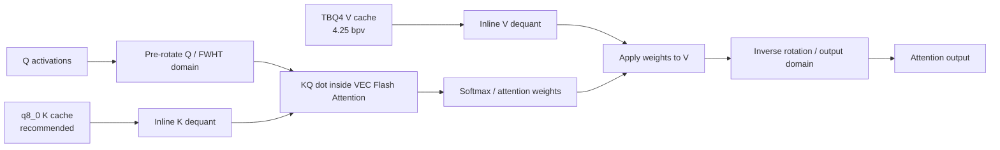
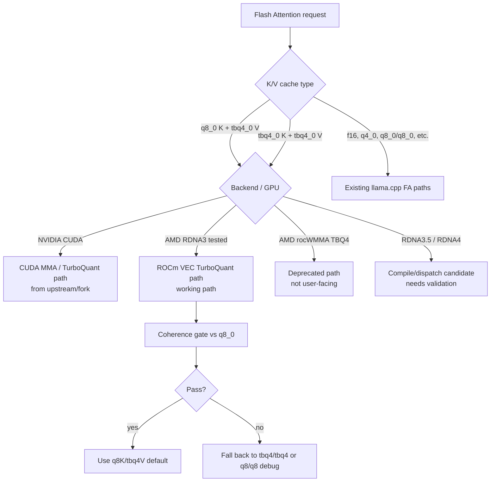

# llama.cpp ROCm + Vulkan TurboQuant KV Cache — Qwen3.6 27B MTP + 35B MoE on RX 7900 XTX

This branch targets AMD RDNA3 on an RX 7900 XTX (`gfx1100`) as a **2-in-1 ROCm + Vulkan build**: you can build ROCm-only, Vulkan-only, or one combined `build-rocm-vulkan` `llama-server` that exposes both `ROCm0` and `Vulkan0`, then choose the backend at runtime with `--device ROCm0` or `--device Vulkan0`.

The promoted ROCm path is **27B MTP long context** with the TurboQuant setting (`q8_0` K + `tbq4_0` V), plus a **35B MoE prompt-processing path** using the current best MMQ selector. Full long-fill prefill sweeps are still pending.

**Current default:** use `--cache-type-k q8_0 --cache-type-v tbq4_0` with VEC FlashAttention on ROCm. Keep `q8_0/tbq4_0` as the promoted TurboQuant setting, but do **not** describe `q8_0/q4_0` as a ROCm/HIP slow path. The `q8_0/q4_0` caveat in this README is Vulkan/RADV-only: this branch's Vulkan path does not have the optimized mixed `q8_0` K + `q4_0` V FlashAttention route yet, so use `q8_0/tbq4_0`, `tbq4_0/tbq4_0`, or same-type `q4_0/q4_0` / `q8_0/q8_0` when debugging Vulkan. Vulkan is explicitly part of the build/device story here, including the combined ROCm+Vulkan binary; this older experiment branch does not claim Vulkan compressed-KV parity. rocWMMA compressed-KV experiments are deprecated for now and should not be enabled in user-facing builds or wrappers. Short benchmark notes are kept near the bottom of this README.

The goal is simple:

- promote the best user-facing TurboQuant default: `--cache-type-k q8_0 --cache-type-v tbq4_0`,
- keep MTP/speculative decoding working,
- keep the default ROCm production Flash Attention route on the stable VEC path,
- keep the combined ROCm+Vulkan build obvious and selectable with `--device ROCm0` or `--device Vulkan0`,
- keep the 35B MoE prompt-processing selector build-gated with `-DRDNA2_MATMUL_OPT_V1=1` and runtime-gated with `RDNA2_MATMUL_OPT_V1=1 GGML_CUDA_MMQ_MAX_X=48`, usable with or without speculative MTP enabled,
- deprecate the rocWMMA compressed-KV prototype for now,
- keep `tbq4_0/tbq4_0` as the lowest-VRAM fallback when maximum context matters more than K quality/speed.

This is not a general "all AMD GPUs are supported" claim. The tested target is RDNA3 / RX 7900 XTX. RDNA3.5 and RDNA4 are compile/dispatch candidates, but still need real validation.

## Branch map

Structured from the upstream/fork README survey: **what works**, **what is deprecated**, **how to turn on the supported path**, and **what was actually tested**.

Read this branch like this:

| Area | What works here | What to expect |
|---|---|---|
| ROCm/HIP production path | Qwen3.6-27B MTP + `q8_0` K / `tbq4_0` V on RX 7900 XTX | Use `build-rocm`; default compressed-KV route stays VEC, not WMMA |
| MTP/speculative decoding | Qwen MTP works via upstream-style `--spec-type draft-mtp`; legacy `mtp` alias is still accepted; PR #23198 prefill fix included | Keep `--parallel 1`; use bounded draft length; `n_max=3` is best observed here |
| TurboQuant-style KV usage | `--cache-type-k/--cache-type-v` is the user-facing contract, same as upstream/forks | Best default is `q8_0/tbq4_0`; `tbq4_0/tbq4_0` is the lower-VRAM fallback; the `q8_0/q4_0` caveat is Vulkan/RADV-only, not a ROCm/HIP slow-path claim |
| 35B MoE prefill | 35B path requires build `-DRDNA2_MATMUL_OPT_V1=1` plus runtime `RDNA2_MATMUL_OPT_V1=1 GGML_CUDA_MMQ_MAX_X=48` | Current best pp selector; applies to prompt processing whether speculative MTP is enabled or not |
| Vulkan | Vulkan build and device listing work; combined ROCm+Vulkan build also works | Vulkan compressed-KV parity is **not** claimed yet; treat it as backend availability, not TBQ4/Planar/Iso feature parity |
| Deprecated/research kernels | rocWMMA compressed-KV variants are not a user path | Do not enable `TBQ4_WMMA_FATTN` / `COMPRESSED_KV_WMMA_FATTN` in production wrappers |

## Pick the path

| Need | Use | Status |
|---|---|---|
| 27B long context + MTP | `q8_0` K + `tbq4_0` V, `--spec-type draft-mtp --spec-draft-n-max 3`, MTP env below | Promoted default for user experience; use `tbq4_0/tbq4_0` only when you need the lowest VRAM / maximum context fallback |
| 35B MoE default | 35B IDs use a binary built with `-DRDNA2_MATMUL_OPT_V1=1` and runtime `RDNA2_MATMUL_OPT_V1=1 GGML_CUDA_MMQ_MAX_X=48`; speculative MTP optional | default llama-swap can use an MTP-capable model without enabling MTP |
| 35B MTP | same 35B MTP-capable model plus `--spec-type draft-mtp --spec-draft-n-max 3` and MTP env below | experimental runtime mode; short result note is at the bottom |
| Vulkan | `build-vulkan` or `--device Vulkan0` in combined build | device works; compressed-KV parity not claimed |

**Do not mix up the env groups:** every MTP route should include `LLAMA_MTP_PREFILL_CHUNK=512 LLAMA_MTP_PREFILL_FORCE_MMQ=1`. The `RDNA2_MATMUL_OPT_V1=1 GGML_CUDA_MMQ_MAX_X=48` pair is the 35B MoE prompt-processing selector; it also requires a binary built with `-DRDNA2_MATMUL_OPT_V1=1`, and it is not a substitute for the MTP prefill allocator workaround.

## Current ROCm runtime summary

Use this README as runtime guidance first; detailed result notes are intentionally moved near the bottom.

| Need | Use | Notes |
|---|---|---|
| Best default user experience | `--cache-type-k q8_0 --cache-type-v tbq4_0` | Promoted TurboQuant setting: keep K fidelity/speed, compress V |
| Lowest VRAM / maximum context fallback | `--cache-type-k tbq4_0 --cache-type-v tbq4_0` | Still useful when context fit matters more than K quality/speed |
| `q8_0/q4_0` ROCm status | `--cache-type-k q8_0 --cache-type-v q4_0` | Not promoted over `q8_0/tbq4_0`, but do not document it as a ROCm/HIP slow path; the slow/unsupported caveat is Vulkan/RADV-only. |
| 3-bit Planar/Iso formats | `planar3_0`, `iso3_0` | Registered and gated, but not promoted as defaults; use only for max-compression experiments |
| 27B MTP | `--spec-type draft-mtp --spec-draft-n-max 3` plus `LLAMA_MTP_PREFILL_CHUNK=512 LLAMA_MTP_PREFILL_FORCE_MMQ=1` | Stable ROCm/MTP server setting |
| 35B MoE prompt-processing | build with `-DCMAKE_HIP_FLAGS="-DRDNA2_MATMUL_OPT_V1=1"`, then run with `RDNA2_MATMUL_OPT_V1=1 GGML_CUDA_MMQ_MAX_X=48` | Works on the MTP-capable 35B model; MTP is a runtime mode, not a different selector |
| rocWMMA compressed-KV | Do not enable | Deprecated for now; VEC FlashAttention is the production path |

Use `--flash-attn on` for quantized V cache. The production AMD path is VEC FlashAttention. The `q8_0/q4_0` slow/unsupported caveat is **Vulkan/RADV-only** in this README; it should not be generalized to ROCm/HIP. `TBQ4_WMMA_FATTN` and `COMPRESSED_KV_WMMA_FATTN` are not recommended toggles.

## What changed

| Area | Status | Notes |
|---|---|---|
| TurboQuant VEC Flash Attention | Working | Production path for `q8_0/tbq4_0` and fallback `tbq4_0/tbq4_0`; dequant happens inside the FA loop |
| Vulkan `q8_0/q4_0` KV | Not supported/promoted on Vulkan | The mixed `q8_0` K + `q4_0` V warning belongs to Vulkan/RADV only; do not cite ROCm/HIP as failing this path. Same-type `q4_0/q4_0` remains the safer Vulkan q4 debug route |
| MTP speculative decoding | Working | Use `--spec-type draft-mtp`; old `mtp` alias still works; best observed setting here: `--spec-draft-n-max 3` |
| MTP prefill allocator stability | Working | `LLAMA_MTP_PREFILL_CHUNK=512` plus `LLAMA_MTP_PREFILL_FORCE_MMQ=1` avoids the hipBLAS temp-allocation OOM path |
| MTP prompt-decode speed | Improved | PR #23198 avoids full-logit copies during MTP prompt decode; 35B n3 prefill improved 1376.82 → 1927.00 tok/s, 27B n3 506.34 → 632.04 tok/s in the 8K sweep |
| MTP server shutdown | Fixed | Speculative state is released before the target context/model, so MTP detach no longer double-frees |
| Coherence gate | Passing | q8K/tbq4V and TBQ4 fallback compared against `q8_0` next-token distributions |
| rocWMMA compressed-KV | Deprecated for now | Built during investigation, but not a correct/user-facing path; do not enable in wrappers |
| RotorQuant / `tbq4_0` | Production-smoked on gfx1100 | 32k/64k TBQ4+MTP server smokes pass cleanly |
| PlanarQuant / IsoQuant (`planar3_0`, `iso3_0`) | Fixed and gated | 3-bit original-domain formats; covered by Triton oracle + invariant gates; not default user path |
| 35B MoE MMQ selector | Working, compile+env gated | Build with `-DCMAKE_HIP_FLAGS="-DRDNA2_MATMUL_OPT_V1=1"`, then run with `RDNA2_MATMUL_OPT_V1=1 GGML_CUDA_MMQ_MAX_X=48`; use it for 35B with or without `--spec-type draft-mtp` |
| Vulkan backend | Builds/list-devices | Separate `build-vulkan` and combined `build-rocm-vulkan` verified; compressed-KV Vulkan parity is not claimed |

## Why rocWMMA is deprecated for now

The first ROCm TBQ4 attempt used rocWMMA. It was stable enough to run, but the output was wrong, so it is deprecated for now rather than exposed as an experiment users might accidentally enable.

The working path is the simpler VEC Flash Attention path — the same approach [Stormrage34/llama.cpp-turboquant-hip](https://github.com/Stormrage34/llama.cpp-turboquant-hip) first validated for AMD (`turbo2/3/4` types), adapted here for mixed `q8_0` K + `tbq4_0` V and the pure `tbq4_0/tbq4_0` fallback:

1. keep the recommended K cache at `q8_0`,
2. dequantize compressed V inside the attention loop,
3. keep the pure TBQ4 fallback for lowest-VRAM context fit,
4. validate output against `q8_0` baselines.

That path is slower than a mature native matrix-core implementation could be, but it is the correct, validated path to use and debug today.

### TurboQuant VEC Flash Attention path



The promoted route keeps K at `q8_0` and compresses V as `tbq4_0`. TBQ4 V is not first expanded globally; dequant happens inside the attention path.

### Dispatch decision



This separates working, deprecated, and untested instead of blending them together.

## Build (ROCm, Vulkan, or ROCm+Vulkan / RX 7900 XTX)

### Prerequisites

- ROCm 7.2.3+ (tested: `/opt/rocm-7.2.3`)
- HIP compiler: `/opt/rocm-7.2.3/bin/amdclang++`
- Vulkan/RADV runtime for Vulkan builds
- GPU: RDNA3 (`gfx1100`/`gfx1101`/`gfx1102`/`gfx1103`)
- Model: Qwen3.6 MTP GGUF (see below)

### Build: choose one binary shape

All three build shapes use the same branch and source tree. Pick the one that matches what you want to test:

- `build-rocm`: ROCm/HIP production path for TurboQuant-style KV and 35B MoE prompt processing.
- `build-vulkan`: Vulkan backend/device smoke path. In this experiment branch, compressed-KV Vulkan parity is **not** claimed.
- `build-rocm-vulkan`: 2-in-1 binary that can expose both `ROCm0` and `Vulkan0`; choose the active backend at runtime with `--device`.

```bash
git clone https://github.com/DrBearJew/llama.cpp.git
cd llama.cpp
git checkout tbq4-rdna3-experiment

# ROCm/HIP production build
cmake -B build-rocm -DGGML_HIP=ON \
  -DAMDGPU_TARGETS=gfx1100 \
  -DCMAKE_HIP_COMPILER=/opt/rocm-7.2.3/bin/amdclang++ \
  -DCMAKE_HIP_FLAGS="-DRDNA2_MATMUL_OPT_V1=1" \
  -DCMAKE_BUILD_TYPE=Release
cmake --build build-rocm --target llama-server -j8

# Vulkan-only backend check
cmake -B build-vulkan -DGGML_VULKAN=ON -DGGML_HIP=OFF -DCMAKE_BUILD_TYPE=Release
cmake --build build-vulkan --target llama-server -j8

# Combined ROCm+Vulkan 2-in-1 build
cmake -B build-rocm-vulkan \
  -DGGML_HIP=ON -DGGML_VULKAN=ON \
  -DAMDGPU_TARGETS=gfx1100 \
  -DCMAKE_HIP_COMPILER=/opt/rocm-7.2.3/bin/amdclang++ \
  -DCMAKE_HIP_FLAGS="-DRDNA2_MATMUL_OPT_V1=1" \
  -DCMAKE_BUILD_TYPE=Release
cmake --build build-rocm-vulkan --target llama-server -j8
```

Do **not** rebuild per model, and do **not** set model-route env at CMake time; those are runtime settings.

The `-DRDNA2_MATMUL_OPT_V1=1` HIP compile flag only makes the RDNA2/RDNA3 MMQ selector code available. You still must set runtime `RDNA2_MATMUL_OPT_V1=1` to enable that path; if the binary is built without the compile flag, the runtime env is ignored.

### Run: ROCm routes

Use `./build-rocm/bin/llama-server` for ROCm-only builds. If you built the combined binary, use `./build-rocm-vulkan/bin/llama-server --device ROCm0` instead.

Set env per server entry or wrapper at runtime. MTP examples use `--batch-size 512 --ubatch-size 512` to match `LLAMA_MTP_PREFILL_CHUNK=512`; the 35B no-MTP example keeps `--batch-size 1024 --ubatch-size 512` for prompt processing.

| Route | Runtime env to set |
|---|---|
| 27B MTP | `LLAMA_MTP_PREFILL_CHUNK=512 LLAMA_MTP_PREFILL_FORCE_MMQ=1` |
| 35B MoE prompt-processing / non-MTP | build-time `-DRDNA2_MATMUL_OPT_V1=1`; runtime `RDNA2_MATMUL_OPT_V1=1 GGML_CUDA_MMQ_MAX_X=48` |
| 35B MoE with MTP enabled | build-time `-DRDNA2_MATMUL_OPT_V1=1`; runtime `RDNA2_MATMUL_OPT_V1=1 GGML_CUDA_MMQ_MAX_X=48 LLAMA_MTP_PREFILL_CHUNK=512 LLAMA_MTP_PREFILL_FORCE_MMQ=1` |

```bash
# 35B MoE default: prompt-processing selector, MTP disabled
RDNA2_MATMUL_OPT_V1=1 \
GGML_CUDA_MMQ_MAX_X=48 \
./build-rocm/bin/llama-server \
  -m /path/to/Qwen3.6-35B-A3B-Q4_K_M.gguf \
  --cache-type-k q8_0 --cache-type-v tbq4_0 \
  --flash-attn on \
  --batch-size 1024 --ubatch-size 512 --cache-ram 128 \
  --jinja --chat-template-file docs/rocm-tbq4-paths/qwen36-merged-template.jinja \
  -c 32768 --port 8080 --no-webui --no-warmup --parallel 1

# 35B MoE with explicit MTP enabled: combine the MoE selector with the MTP prefill env
RDNA2_MATMUL_OPT_V1=1 \
GGML_CUDA_MMQ_MAX_X=48 \
LLAMA_MTP_PREFILL_CHUNK=512 \
LLAMA_MTP_PREFILL_FORCE_MMQ=1 \
./build-rocm/bin/llama-server \
  -m /path/to/Qwen3.6-35B-A3B-MTP-Q4_K_M.gguf \
  --cache-type-k q8_0 --cache-type-v tbq4_0 \
  --flash-attn on \
  --batch-size 512 --ubatch-size 512 --cache-ram 128 \
  --spec-type draft-mtp --spec-draft-n-max 3 \
  --jinja --chat-template-file docs/rocm-tbq4-paths/qwen36-merged-template.jinja \
  -c 32768 --port 8080 --no-webui --no-warmup --parallel 1
```

### Run: Vulkan or combined backend checks

Vulkan is useful as a backend check today. Compressed-KV Vulkan parity is **not** claimed yet in this experiment branch.

```bash
# Vulkan-only: check device name; expect Vulkan0 on this box
LD_LIBRARY_PATH=$PWD/build-vulkan/bin \
  ./build-vulkan/bin/llama-server --list-devices

# Vulkan-only: start a small server smoke
MODEL=/path/to/model.gguf
LD_LIBRARY_PATH=$PWD/build-vulkan/bin \
  ./build-vulkan/bin/llama-server \
  -m "$MODEL" --device Vulkan0 \
  --ctx-size 4096 --host 127.0.0.1 --port 8080 \
  --no-webui --no-warmup -ngl 99

# Combined build: list devices; expect both ROCm0 and Vulkan0 when both backends load
LD_LIBRARY_PATH=$PWD/build-rocm-vulkan/bin:/opt/rocm-7.2.3/lib:/opt/amdgpu/lib/x86_64-linux-gnu:${LD_LIBRARY_PATH:-} \
  ./build-rocm-vulkan/bin/llama-server --list-devices

# Combined build: pick Vulkan explicitly
LD_LIBRARY_PATH=$PWD/build-rocm-vulkan/bin:/opt/rocm-7.2.3/lib:/opt/amdgpu/lib/x86_64-linux-gnu:${LD_LIBRARY_PATH:-} \
  ./build-rocm-vulkan/bin/llama-server \
  -m "$MODEL" --device Vulkan0 \
  --ctx-size 4096 --no-webui --no-warmup -ngl 99

# Combined build: pick ROCm/HIP explicitly
LD_LIBRARY_PATH=$PWD/build-rocm-vulkan/bin:/opt/rocm-7.2.3/lib:/opt/amdgpu/lib/x86_64-linux-gnu:${LD_LIBRARY_PATH:-} \
  ./build-rocm-vulkan/bin/llama-server \
  -m "$MODEL" --device ROCm0 \
  --cache-type-k q8_0 --cache-type-v tbq4_0 \
  --flash-attn on --ctx-size 4096 --no-webui --no-warmup -ngl 99
```

Docker helper:

```bash
scripts/vulkan/start-vulkan-docker-server.sh --list-devices
PORT=8080 CTX_SIZE=4096 scripts/vulkan/start-vulkan-docker-server.sh /path/to/model.gguf --no-warmup
```

### Quick toggles: experiments

Keep production boring. Flip these only when testing:

| Want | Toggle / command | Note |
|---|---|---|
| 27B / explicit 35B MTP stability | `LLAMA_MTP_PREFILL_CHUNK=512 LLAMA_MTP_PREFILL_FORCE_MMQ=1` | Required for MTP routes; pair with `--spec-type draft-mtp --parallel 1`; default KV is `q8_0/tbq4_0` |
| 35B MoE prefill boost | build with `-DRDNA2_MATMUL_OPT_V1=1`, run with `RDNA2_MATMUL_OPT_V1=1 GGML_CUDA_MMQ_MAX_X=48` | Best current 35B prompt-processing setting; not the MTP OOM workaround |
| TBQ4 local experiment pair | `TBQ4_COOP_SET_ROWS=1 TBQ4_LAYER_ADAPTIVE=7` | Best current fixed-seed 8K MTP ablation pair; use for TBQ4 probes, not required for baseline correctness |
| TBQ4 vec norm hoist probe | `GGML_CUDA_TBQ4_VEC_NORM_HOIST=1` | Probe only; single-run looked good, fixed-seed combo was worse than leaving it unset |
| TBQ4 LDS route probe | `GGML_CUDA_TBQ4_LDS_ROUTE=D_K` | Probe only; not promoted |
| TBQ4 inner-Q probe | `TBQ4_INNERQ=256` | Probe only; not promoted |
| Sparse-V probe | `GGML_CUDA_SPARSE_V_DEQUANT=1` | Optional/default-off; short 8K probe was near-neutral |
| Sparse-V tau probe | `GGML_CUDA_SPARSE_V_TAU_LEVEL=3` | Only meaningful with sparse-V enabled; tau alone is invalid/misleading |
| Deprecated rocWMMA FA | `TBQ4_WMMA_FATTN=1`, `COMPRESSED_KV_WMMA_FATTN=1` | Do not use for now; VEC is the production path |
| Compressed-KV FA logging | `COMPRESSED_KV_FATTN_LOG=1` | Diagnostic logging only; not a performance setting |
| IQ4_XS scratch MMQ | `RDNA2_MATMUL_OPT_V1=1 GGML_CUDA_IQ4_XS_MMQ_SCRATCH16K=1` | Coherent, but slower so far |

### Chat template (Qwen 3.6)

Use the merged template included in this repo (`docs/rocm-tbq4-paths/qwen36-merged-template.jinja`).
It supports `<|think_off|>`, developer role, and tool calls.

Source repos:
- [allanchan339/vLLM-Qwen3-Chat-Template-Fix](https://github.com/allanchan339/vLLM-Qwen3-3.5-3.6-chat-template-fix)
- [froggeric/Qwen-Fixed-Chat-Templates](https://huggingface.co/froggeric/Qwen-Fixed-Chat-Templates)

## MTP finding

The llama.cpp server default for `--spec-draft-n-max` is 16. On this setup, that was too aggressive and lowered aggregate acceptance.

For this model/backend, `--spec-draft-n-max 3` gave the best observed result. The old short-run acceptance check was:

| KV cache | `n_max` | Drafted | Accepted | Accept rate | Speed |
|---|---:|---:|---:|---:|---:|
| `q8_0` | 3 | 57 | 44 | 77.2% | 49.8 tok/s |
| `tbq4_0` | 3 | 54 | 45 | 83.3% | 54.0 tok/s |
| `tbq4_0` | 16 | 144 | 53 | 36.8% | 38.1 tok/s |

The current post-PR #23198 8K sweep keeps the same conclusion: `n_max=3` is still the best overall setting, and the MTP prefill penalty is now much smaller.

| Model | Mode | Prompt tok/s | Decode tok/s | Accepted | vs no-MTP decode |
|---|---|---:|---:|---:|---:|
| 35B MoE | no MTP | 2240.20 | 75.11 | - | baseline |
| 35B MoE | MTP `n_max=3` | 1927.00 | 101.67 | 81/135 | +35.4% |
| 27B | no MTP | 682.84 | 26.10 | - | baseline |
| 27B | MTP `n_max=3` | 632.04 | 47.26 | 90/110 | +81.1% |

This does not prove TBQ4 improves MTP acceptance. It shows that, **in these tested runs**, TBQ4 did not damage acceptance compared with `q8_0`, and PR #23198 removes most of the old MTP prompt-fill slowdown.

## Validation

The coherence gate compares TBQ4 against a `q8_0` KV baseline. It does not compare against FP16 or FP32 — `q8_0` is itself quantized.

Quick-mode result (4k context):

| Layer | Result | Notes |
|---|---|---|
| Smoke | PASS | Basic deterministic prompts |
| Precision | PASS | 100% top-1 match, 0.945 Jaccard, 0.0017 JSD vs `q8_0` |
| Canaries | PASS | JSON, ChatML leak guard, tool-call schema, code syntax |
| MTP | PASS | 83.3% acceptance in the tested run |
| Cache | PASS | Same output with and without `cache_prompt` |

This is a practical correctness gate, not a proof of mathematical losslessness.

Compressed-KV prototype/gate coverage also includes `planar3_0` and `iso3_0`:

| Gate | Formats | Result |
|---|---|---|
| `experiments/compressed_kv_triton/run_all.sh` | `planar3_0`, `iso3_0`, `tbq4_0` | PASS |
| `run_all_json.py` | `planar3_0`, `iso3_0`, `tbq4_0` | PASS 20/20 |
| `scripts/hip/check-compressed-kv-fa-invariants.sh` | production dispatch/gating | PASS |

The long-context production server smokes are TBQ4-focused. Planar/Iso are fixed and covered by the compressed-KV gates, but their rocWMMA route is deprecated for now rather than opt-in production guidance.

### Run the gate

```bash
cd docs/rocm-tbq4-paths

# Quick mode (< 5 min, 4k ctx)
python3 harness.py --quick

# Full gate (64k ctx, needle retrieval, long prompts)
python3 harness.py --tbq4-ctx 65536 --q8-ctx 16384
```

Results are written to `gate-summary.json`.


## Key files changed

| File | Purpose |
|---|---|
| `ggml/src/ggml-cuda/fattn-common.cuh` | `vec_dot_fattn_vec_KQ_tbq4_0`, `dequantize_V_tbq4_0` |
| `ggml/src/ggml-cuda/fattn-vec.cuh` | `DECL_FATTN_VEC_CASE` for TBQ4 D=64/128/256 |
| `ggml/src/ggml-cuda/fattn.cu` | Routes AMD RDNA targets to the VEC TurboQuant path |
| `ggml/src/ggml-cuda/mmq.cu` | Env-gated MTP prefill MMQ routing for supported quantized matmuls |
| `ggml/src/ggml-cuda/mmq.cuh` | 256-thread MMQ workgroup cleanup plus `GGML_CUDA_MMQ_MAX_X` selector cap |
| `src/llama-context.cpp` | MTP prefill chunking and safer hook-batch storage |
| `src/llama-mtp.h` | Vector-backed hook batch storage |
| `tools/server/server-context.cpp` | Releases speculative MTP state before freeing the target context |
| `src/llama-kv-cache.cpp` | Disables generic `attn_rot_*` for TBQ4 |
| `ggml/src/ggml-cuda/fattn-wmma-tbq4.cu` | Deprecated rocWMMA prototype (not user-facing) |

### Bugs fixed

1. **VEC correctness**: `dequantize_V_tbq4_0` used wrong index; TBQ4 was double-rotated via generic Hadamard
2. **VEC prefill speed**: TBQ4 KQ dot used f16-style `Q_reg` but RDNA quantized lane mapping → fixed with `KQ_uses_Q_reg` + `nthreads_KQ=8`
3. **Rotation model**: TBQ4 stores K/V in signed-FWHT domain; Q pre-rotated, output inverse-rotated
4. **MTP request-time OOM**: draft-prefill hipBLAS temp allocation could request multi-GiB buffers; supported quantized MTP prefill matmuls can be routed through MMQ with `LLAMA_MTP_PREFILL_FORCE_MMQ=1`
5. **MTP shutdown double-free**: server cleanup freed the target context before speculative MTP state detached from it; speculative state now resets first
6. **MTP prompt-decode logits copy**: upstream PR #23198 avoids copying full logits for every prompt token when MTP only needs pre-norm embeddings; this fixes most of the old 8K MTP prefill slowdown

## GPU architecture status

Emphasis: "enabled" means the code dispatches, not that the path has been tested.

| Family | Targets | Status |
|---|---|---|
| RDNA3 | gfx1100/1101/1102/1103 | **Tested on gfx1100** — VEC FA + MTP verified |
| RDNA3.5 | gfx1150/1151/1152 | Dispatch candidate — same VEC path, **untested** |
| RDNA4 | gfx1200/1201+ | Dispatch candidate — `amd_wmma_available()` gate enabled, **untested** |
| RDNA1/RDNA2 | gfx10xx | Not routed to TBQ4 VEC |
| CDNA/MI* | gfx9x/gfx94x | Not routed |
| NVIDIA | sm_80/sm_89/sm_90 | Existing CUDA MMA TBQ4 path from upstream |

Validation steps for a new GPU family:

1. build with `AMDGPU_TARGETS=<gfx>`,
2. run smoke + precision probes (harness quick mode),
3. run at least 8k and 32k needle tests,
4. run MTP acceptance test,
5. record VRAM and throughput separately from correctness.

## Getting an MTP-capable GGUF

**Option A — Pre-built (recommended)**

```bash
# llmfan46's pre-built GGUF with 15 native MTP heads (~17 GB, Q4_K_M)
wget https://huggingface.co/llmfan46/Qwen3.6-27B-uncensored-heretic-v2-Native-MTP-Preserved-GGUF/resolve/main/Qwen3.6-27B-uncensored-heretic-v2-Native-MTP-Preserved-Q4_K_M.gguf
```

**Option B — Graft MTP heads onto any Qwen3.6 GGUF**

```bash
wget https://huggingface.co/havenoammo/Qwen3.6-27B-MTP-UD-GGUF/resolve/main/MTP-Q8_0.gguf
uv pip install gguf
python convert.py base-model.gguf MTP-Q8_0.gguf output-mtp.gguf
```

## Key flags

| Flag | Purpose |
|---|---|
| `--cache-type-k q8_0 --cache-type-v tbq4_0` | Recommended TurboQuant KV default: q8 K fidelity/speed with compressed TBQ4 V |
| `--cache-type-k tbq4_0 --cache-type-v tbq4_0` | Lowest-VRAM fallback for maximum context fit |
| `--cache-type-k q8_0 --cache-type-v q8_0` | Diagnostic/reference KV cache (highest VRAM) |
| `--flash-attn on` | Required for quantized V cache |
| `--batch-size 512 --ubatch-size 512` | Validated MTP+TurboQuant server batch settings; matches `LLAMA_MTP_PREFILL_CHUNK=512` |
| `--cache-ram 128` | Keeps host-side prompt/cache reuse bounded in the tested server setup |
| `--spec-type draft-mtp --spec-draft-n-max 3` | MTP; `n_max=3` was best observed here; `mtp` alias still works |
| `LLAMA_MTP_PREFILL_CHUNK=512` | Chunks target hidden-state transfer into draft-prefill decode calls |
| `LLAMA_MTP_PREFILL_FORCE_MMQ=1` | Env-gated workaround for MTP draft-prefill hipBLAS/ROCm temp allocation OOM |
| `--jinja --chat-template-file <path>` | Qwen merged chat template |
| `--parallel 1` | Required for MTP |
| build `-DCMAKE_HIP_FLAGS="-DRDNA2_MATMUL_OPT_V1=1"` + runtime `RDNA2_MATMUL_OPT_V1=1 GGML_CUDA_MMQ_MAX_X=48` | Best current Qwen3.6-35B-A3B prompt-processing selector; compatible with MTP-capable models, but MTP still needs the `LLAMA_MTP_PREFILL_*` pair |
| `TBQ4_COOP_SET_ROWS=1 TBQ4_LAYER_ADAPTIVE=7` | Preferred local TBQ4 experiment pair from fixed-seed 8K MTP ablation; keep separate from baseline/runtime-required flags |
| `GGML_CUDA_TBQ4_VEC_NORM_HOIST=1` | TBQ4 probe only; leave unset unless explicitly testing |
| `GGML_CUDA_TBQ4_LDS_ROUTE=D_K` | TBQ4 probe only; leave unset unless explicitly testing |
| `TBQ4_INNERQ=256` | TBQ4 probe only; leave unset unless explicitly testing |
| `GGML_CUDA_SPARSE_V_DEQUANT=1` | Optional sparse-V dequant probe; default-off |
| `GGML_CUDA_SPARSE_V_TAU_LEVEL=3` | Sparse-V tau probe; use only together with `GGML_CUDA_SPARSE_V_DEQUANT=1` |
| `TBQ4_WMMA_FATTN=1` | Deprecated rocWMMA compressed-KV path; avoid for production |
| `COMPRESSED_KV_WMMA_FATTN=1` | Deprecated rocWMMA compressed-KV path; avoid for production |
| `COMPRESSED_KV_FATTN_LOG=1` | Diagnostic logging only |
| `--no-warmup` | Skip startup warmup |

## Credits

### ROCm TBQ4 VEC path

- **[Stormrage34/llama.cpp-turboquant-hip](https://github.com/Stormrage34/llama.cpp-turboquant-hip)** — **First working AMD VEC TurboQuant path** (RDNA2, `turbo2/3/4` KV types, BFE dequant, MoE LDS accelerator). Our TBQ4 VEC path follows the same inline-dequant-inside-FA pattern, adapted for the `tbq4_0` block format and RDNA3.
- **[TheTom/llama-cpp-turboquant](https://github.com/TheTom/llama-cpp-turboquant)** — Original TurboQuant reference implementation (block formats, FWHT rotation model, centroids)
- **[adelj88/rocm_wmma_gemm](https://github.com/adelj88/rocm_wmma_gemm)** — rocWMMA reference used in the now-deprecated prototype
- **[Kaden-Schutt/hipfire](https://github.com/Kaden-Schutt/hipfire)** — MMQ screening concept that inspired the coherence gate design

### MTP and TurboQuant foundation

- **[Indras-Mirror/llama.cpp-mtp](https://github.com/Indras-Mirror/llama.cpp-mtp)** — Base fork with fused CUDA MMA TBQ4 FA, MTP, RotorQuant, tensor sharing
- **[ggml-org/llama.cpp](https://github.com/ggml-org/llama.cpp)** — PR #22673 (MTP support by ngxson, am17an), PR #21089 (CPU TBQ)
- **[spiritbuun](https://github.com/spiritbuun)** — dflash fork with CUDA TurboQuant kernels
- **[ikawrakow/ik_llama.cpp](https://github.com/ikawrakow/ik_llama.cpp)** — MTP improvements PR #1736

### Models and tooling

- **[llmfan46](https://huggingface.co/llmfan46)** — Qwen3.6-27B-Heretic-v2 Native-MTP-Preserved GGUF
- **[HauhauCS](https://huggingface.co/HauhauCS)** — Original Qwen3.6-Heretic-v2 uncensored base model
- **[havenoammo](https://huggingface.co/havenoammo)** — MTP graft tooling, first Qwen3.6-MTP GGUF release
- **[Radamanthys11](https://huggingface.co/Radamanthys11)** — MTP-Q8_0 GGUF extraction

### Chat templates

- **[allanchan339/vLLM-Qwen3-Chat-Template-Fix](https://github.com/allanchan339/vLLM-Qwen3-3.5-3.6-chat-template-fix)** — Tool system prompt, developer role
- **[froggeric/Qwen-Fixed-Chat-Templates](https://huggingface.co/froggeric/Qwen-Fixed-Chat-Templates)** — `<|think_on|>`/`<|think_off|>` toggles, `</thinking>` recognition

---

## ROCm result notes (short)

These are result summaries, not first-run instructions. Prefer the build/run commands above.

- **Promoted q8K/tbq4V path:** `q8_0` K + `tbq4_0` V is now the default recommendation for user experience. Evidence: q8K/tbq4V NIAH passed 3/3 at 8k, sparse-V PPL delta was ~0.36%, and PPL ratios stayed near 1.0004-1.0020 across sparse-V thresholds.
- **Long-context fallback:** pure `tbq4_0/tbq4_0` remains the lowest-VRAM escape hatch. 32k/64k server smokes were clean; 128k/200k allocation-fit smokes stayed within roughly 21.5-23.0 GiB on RX 7900 XTX.
- **3-bit Planar/Iso formats:** the names are `planar3_0` and `iso3_0` (not Sonar). They are original-domain 3-bit compressed KV formats, fixed/gated, and useful for max-compression experiments, but not promoted over `q8_0/tbq4_0`. Short canaries fit 128k/200k: `planar3_0` about 32.9/34.9 tok/s at 21.10/22.36 GiB, `iso3_0` about 36.2/34.8 tok/s at 21.10/22.36 GiB.
- **MTP after PR #23198:** `--spec-draft-n-max 3` remains the best observed draft length. The 8k sweep measured 27B MTP at ~632 prompt tok/s / ~47 decode tok/s and 35B MTP at ~1927 prompt tok/s / ~102 decode tok/s.
- **35B MoE selector:** build with `-DCMAKE_HIP_FLAGS="-DRDNA2_MATMUL_OPT_V1=1"`, then run with `RDNA2_MATMUL_OPT_V1=1 GGML_CUDA_MMQ_MAX_X=48`. The selector is still useful on an MTP-capable 35B model; enabling MTP is a separate runtime choice. The selector sweep peaked around pp128 1781, pp256 2480, pp512 3150 tok/s.
- **rocWMMA status:** compressed-KV rocWMMA prototypes are deprecated for now. They were useful for investigation, but the validated ROCm path is VEC FlashAttention.
- **Vulkan q8K/q4V caveat:** `q8_0/q4_0` is not the Vulkan fallback recommendation. The slow/unsupported observation belongs to the Vulkan/RADV branch checks only; do not extend it to ROCm/HIP. Older upstream Vulkan `q8_0/q4_0` comparisons with `RADV_PERFTEST=nogttspill` should be treated as historical backend baselines only, not as guidance for this branch.

Artifacts referenced by these notes include `benches/rocm-rdna3/pr23198-mtp-prefill-check-20260518-001214/summary.md`, `benches/rocm-rdna3/ctx-fit-quant-sweep-20260516-004216/summary.json`, `benches/rocm-rdna3/q8k-tbq4v-vec-sparsev-20260516-041159/quality-summary.json`, `benches/rocm-rdna3/q8k-tbq4v-sparsev-quality-sweep-20260516-052442/ppl-kld-summary.md`, and `benches/rocm-rdna3/qwen35b-pp128-256-512-20260516-005350/summary.variants.clean.md`.

<details>
<summary><strong>Original NVIDIA benchmarks and docs (from Indras-Mirror)</strong></summary>

## NVIDIA results (RTX 4090 24GB, Qwen3.6-27B-Heretic-v2-MTP Q4_K_M)

| Config | Context | KV cache | tok/s | Draft accept | VRAM |
|---|---|---|---|---|---|
| MTP + Fused TBQ4 FA | 262K | TBQ4_0 (4.25 bpv) | 80–179 | 73–93% | ~20 GB |
| MTP + Q4_0 KV | 200K | Q4_0 (4.5 bpv) | 92–97 | 93.6% | 23.96 GB |
| Baseline (no MTP, Q4_0 KV) | 200K | Q4_0 | ~40 | — | 23.96 GB |

### NVIDIA build

```bash
cmake -B build -DGGML_CUDA=ON -DCMAKE_BUILD_TYPE=Release -DCMAKE_CUDA_ARCHITECTURES=89
cmake --build build -j$(nproc) --config Release

./build/bin/llama-server \
  -m your-qwen3.6-mtp.gguf \
  --spec-type draft-mtp --spec-draft-n-max 3 \
  -ctk tbq4_0 -ctv tbq4_0 -c 262144 -ngl 99 \
  --flash-attn on --mlock -t 8 -ub 32 --parallel 1 --no-warmup
```

### RotorQuant benchmarks (RTX 4090)

| Type | 4K ctx | 32K ctx | 262K ctx | Notes |
|---|---|---|---|---|
| `tbq4_0` | 55.3 t/s | 51.5 t/s | 77 t/s | Baseline — fused MMA kernel |
| `planar3_0` | 53.9 t/s | 50.6 t/s | ~47 t/s | Best speed/compression tradeoff |
| `iso3_0` | 53.5 t/s | 50.5 t/s | — | Same compression as planar3 |

### NVIDIA TBQ4 MMA architecture

Fused TBQ4 Flash Attention pipeline:

1. `k_tbq4_rotate_input` → Pre-rotate Q via FWHT
2. Fused FA kernel → Read raw TBQ4 blocks, centroid×norm dequant inline
3. `k_tbq4_rotate_output` → Post-rotate VKQ back to original domain

TBQ4_0 block: 66 bytes per 128 elements (4.25 bpv)

- `ggml_half d` — corrected L2 norm (2 bytes)
- `uint8_t qs[64]` — packed 4-bit centroid indices (64 bytes)
- 16 Lloyd-Max centroids in `__constant__` memory

### Tensor sharing

```cpp
LLAMA_API void llama_model_link_shared_tensors(
    struct llama_model * model,
    const struct llama_model * trunk);
```

### Known issues (from upstream)

- Vision + MTP crashes. Use `--spec-type none` for vision tasks.
- MTP requires `--parallel 1`.
- 7B models crash with TBQ4 (16-byte alignment).
- MoE models may fail if GGUF metadata is incomplete.

</details>

## License

MIT. See upstream [llama.cpp](https://github.com/ggml-org/llama.cpp).
