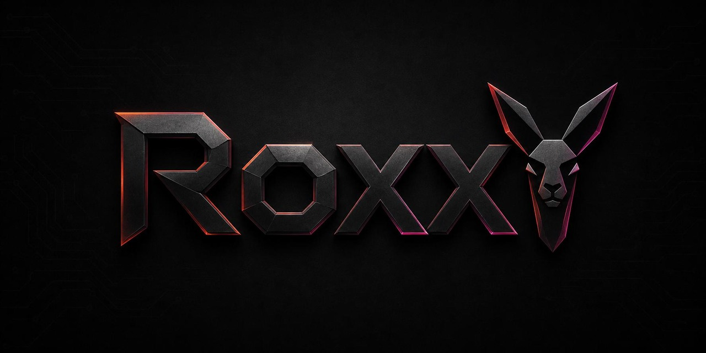
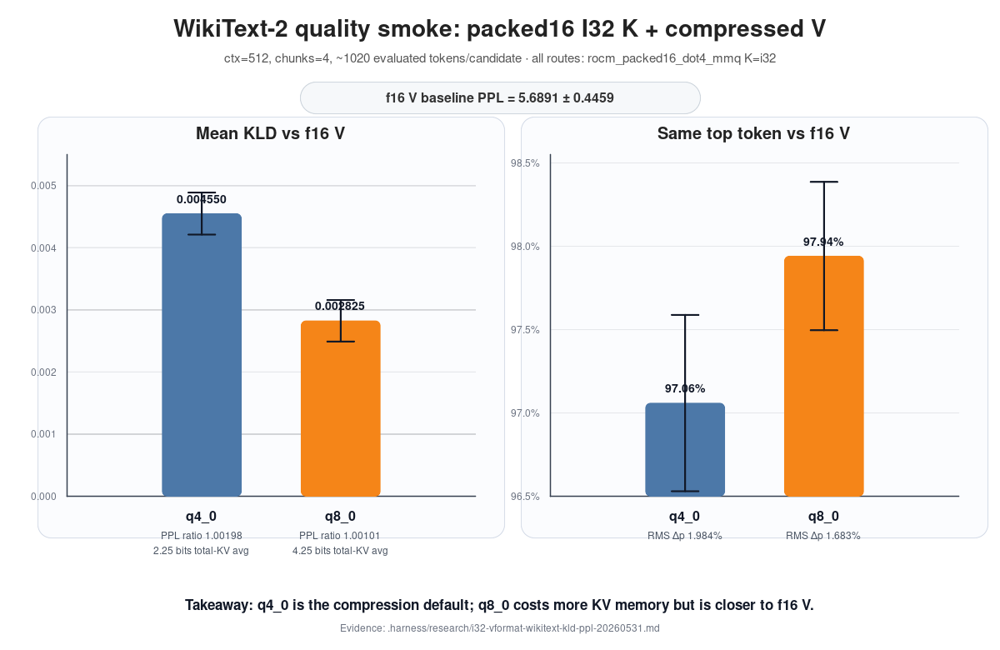
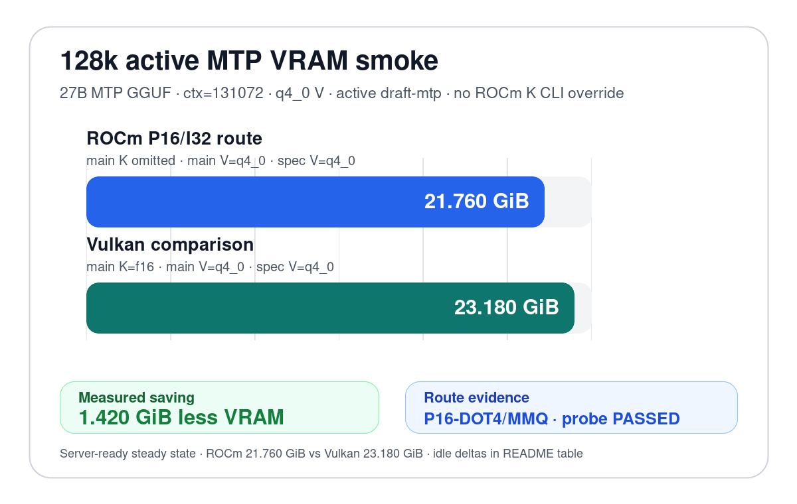

# RoxxY — Packed K-cache FlashAttention for RDNA3



RoxxY is the standalone GitHub home for this RDNA3-focused `llama.cpp` branch
with packed K-cache FlashAttention. Clone this repository directly; it is no
longer installed from `DrBearJew/llama.cpp`.

The normal path is simple: build the default branch, run `llama-server` or
`llama-bench`, and let the route selector pick the default packed16 kernels
automatically. Optional packed8/packed4 q4 K aliases are also available for
q4-storage experiments.

Packed16 and packed8/packed4 q4 are **runtime K-cache layouts**, not new GGUF
model formats. The default packed16 path stores K as I32 payload rows, with each
32-bit word carrying four packed 8-bit K values. The optional q4 path stores the
same kind of I32 payload rows with each 32-bit word carrying eight packed 4-bit
K values. F16 scales remain separate in both cases.

---

## Start here: recommended MTP server launch

Set your model path once, then run `llama-server` directly. For the measured Qwen3.6 27B Q4_K_M MTP speed profile, use the single PV4 opt-in and pure MTP, without `--spec-default`:

```bash
MODEL=/path/to/Qwen3.6-27B-Q4_K_M-mtp.gguf

GGML_CUDA_ROCM_V4_K16D16_144_PV4=1 \
./build-rocm/bin/llama-server \
  --device ROCm0 \
  --model "$MODEL" \
  --flash-attn on \
  --cache-type-v q4_0 \
  --cache-type-v-draft q4_0 \
  --ctx-size 40960 --batch-size 2048 --ubatch-size 512 \
  --parallel 1 --no-warmup \
  --spec-type draft-mtp \
  --spec-draft-n-max 4 --spec-draft-p-min 0 \
  --spec-draft-prio 2 --spec-draft-prio-batch 2
```

That is the pure-MTP active-RS path. The PV4 switch implies the internal V144/PV4, QBlock/PDMQ, QPack, packed16, and target-batch verifier backend stack. You do not need to set the historical long ROCm/MTP env stack.

`q4_0` is the recommended V-cache choice for the fast MTP path. `q8_0` and
`f16` are supported higher-precision V-cache choices; they use more VRAM and
remain slower than `q4_0` on the measured 27B MTP path.

Do not add `--cache-type-k` for the default packed16/I32 path; K is selected by
the RoxxY runtime layout. To test q4 K storage, set
`GGML_CUDA_ROCM_PDMQ_K_FORMAT=packed8_q4`, `packed4_q4`, or `packed4` instead.
`packed4` is a compatibility alias for the same 144B q4 layout as `packed8_q4`,
not the reserved 80B q2 layout.

Expected default packed16 K + q4_0 V evidence on the measured pure-MTP PV4 profile is approximately:

```text
8k/tg128 clean auto-table smoke: prompt ~744 tok/s, decode ~51.0 tok/s, SHA 4219d799
32k/tg128 BM64-first prefill smoke: prompt ~589 tok/s, decode ~33.2 tok/s, SHA 33fc0c55
n512 long decode smoke: ~42-43 tok/s, SHA 8d10ba2d
```

Draft KV should be about 65 MiB at ctx 40960 before V144/PV4 physical route effects on the default packed16 path: packed16 K payload+scales around 42.5 MiB plus q4_0 logical V around 22.5 MiB. Optional q4 K storage is smaller per K row, but current prefill still uses an expand-to-i8 WMMA path and is not the headline speed baseline.

Expected higher-precision typed-V evidence on the same direct/clean command,
with only the V cache type changed, is approximately:

```text
q8_0: ~51-52 tok/s, draft acceptance around 399/565, no selected=587/588
f16:  ~52 tok/s, draft acceptance around 399/565, no selected=587/588
```

Route-log canaries should show `rocm_packed16_dot4_mmq` / `PDMQ2 ... K=i32
V=q8_0 ... vpath=raw_lds_q8_0` or `V=f16 ... vpath=raw_lds_f16` for the
small-Q typed-V path; the old `rocm_packed16_decode` lane is not the typed-V
solution.

---

## Cache/layout notes — packed I32 FlashAttention

Use the launch command above for normal MTP runs. The default rule is simple:
**K uses RoxxY's packed16/I32 layout; V is the precision you choose.** Optional
q4 K storage is selected with `GGML_CUDA_ROCM_PDMQ_K_FORMAT`.

- Do **not** pass `--cache-type-k` for the default packed16/I32 path.
- To test q4 K storage, set `GGML_CUDA_ROCM_PDMQ_K_FORMAT=packed8_q4`. The
  aliases `packed4`, `packed4_q4`, and `packed4_q4_144` select the same 144B q4
  layout. Explicit `packed4_q2` remains reserved/unsupported.
- Pick V precision with `--cache-type-v`. For MTP, set `--cache-type-v-draft`
  the same way when you want the draft context to match.
- The selected packed K layout allocates the physical I32 K payload/scales
  automatically.
- Let the runtime selector choose the FlashAttention kernel; no route-forcing
  environment variables are needed for normal use.

| V cache | Use case | V storage | Contribution to K+V average |
|---|---|---:|---:|
| `q4_0` | Recommended fast MTP default | 4.5 bits/value | 2.25 bits |
| `q8_0` | Higher V precision | 8.5 bits/value | 4.25 bits |
| `f16` | Highest V precision | 16 bits/value | 8 bits |

`q4_0` V is **not i16 V**. It stores packed q4 payload plus f16 scales for the
`P @ V` side only; QK stays on the selected packed I32 PDMQ K path. Choosing
`q8_0` or `f16` raises only the `P @ V` value format while keeping the same K
layout selection. Default packed16-K + q8-V is about 17 bits per K+V pair.

`tbq4_0`, `planar3_0`, and `iso3_0` are legacy/experimental V-format research,
not proper starting options.

Route evidence should look like this:

- Normal long prefill on the default packed16 path usually selects the PWMMA
  packed16/I32 family:

  ```text
  selected=pwmma_bm64_i8qk_pvwmma_dbv ... K=I32 V=<value-type>
  FATTN COMPUTE SELECT selected=... name=rocm_packed16_wmma_tile
  ```

- Optional q4 K storage should show the packed8-expand route, even when selected
  through the `packed4` alias:

  ```text
  k_format=packed8_q4_144 selected=pwmma_bm64_i8qk_packed8_expand_pvwmma_dbv
  ```

- Small-Q/MTP validation may select the DOT4-MMQ/PDMQ family:

  ```text
  rocm_packed16_dot4_mmq / PDMQ2 ... K=i32 V=<value-type>
  ```

If the FlashAttention log says raw `K=q8_0`, you are not validating the packed
I32 PDMQ path. Packed16 and packed8/packed4 q4 should log `K=I32` plus the
corresponding packed `k_format`.

### Fast WikiText quality smoke

Short WikiText-2 raw smoke on the 27B MTP model, `ctx=512`, `chunks=4`
(~1020 evaluated tokens/candidate), all with `K=i32` and
`selected=rocm_packed16_dot4_mmq`. This is a fast sanity check, not a full
quality benchmark.



| V cache | PPL / ratio vs f16 V | Mean KLD vs f16 V | Median KLD | Same top token |
|---|---:|---:|---:|---:|
| f16 | `5.6891 ± 0.4459` | baseline | baseline | baseline |
| q4_0 | `1.00198 ± 0.00422` ratio | `0.004550 ± 0.000338` | `0.001818` | `97.06%` |
| q8_0 | `1.00101 ± 0.00336` ratio | `0.002825 ± 0.000334` | `0.000863` | `97.94%` |

Takeaway: q4_0 is the default compression choice; q8_0 is the higher-precision
choice and is measurably closer to f16 V on this smoke. Evidence:
[`.harness/research/i32-vformat-wikitext-kld-ppl-20260531.md`](.harness/research/i32-vformat-wikitext-kld-ppl-20260531.md).

### 128k active MTP VRAM smoke

A 128k-context server-ready VRAM smoke on the 27B MTP GGUF with active
`draft-mtp`, `q4_0` V, and `--spec-draft-type-v q4_0`. The ROCm packed16 run
omits main and draft K CLI overrides; the Vulkan comparison uses normal f16 main
K plus q4 V.



| Run | Total VRAM used | Delta over idle |
|---|---:|---:|
| ROCm packed16/I32 route + q4 V active MTP | `21.760 GiB` | `21.079 GiB` |
| Vulkan f16 K + q4 V active MTP | `23.180 GiB` | `22.500 GiB` |

Measured saving: Vulkan uses `+1.420 GiB` more total VRAM (`+1.422 GiB` delta
over idle). ROCm route evidence included the packed16 DOT4/MMQ route and `PDMQ QK
probe PASSED`. Evidence:
[`.harness/research/active-mtp-vram-128k-20260531.md`](.harness/research/active-mtp-vram-128k-20260531.md).

---

## Quick start

Build the branch, run a model, and let the branch pick the right packed route
automatically. **No route-forcing env vars are needed for normal packed16 use.**
Optional q4 K storage uses `GGML_CUDA_ROCM_PDMQ_K_FORMAT=packed8_q4` or the
`packed4`/`packed4_q4` aliases.

You need a compatible GGUF model. The tested model families and example
Hugging Face sources are listed below under [Tested models](#tested-models).

```bash
git clone https://github.com/DrBearJew/RoxxY
cd RoxxY
# The default branch is tbq4-rdna3-experiment.

cmake -S . -B build-rocm \
  -DGGML_HIP=ON \
  -DGGML_HIP_ROCWMMA_FATTN=ON \
  -DGPU_TARGETS=gfx1100 \
  -DCMAKE_BUILD_TYPE=Release
cmake --build build-rocm --target llama-server llama-bench -j$(nproc)
```

Run a server:

```bash
./build-rocm/bin/llama-server \
  --device ROCm0 \
  --model /path/to/Qwen3.6-35B-A3B-IQ4_XS-00001-of-00002.gguf \
  --flash-attn on \
  --cache-type-v q4_0 \
  --ctx-size 40960 --parallel 1
```

Benchmark prefill:

```bash
./build-rocm/bin/llama-bench \
  -m /path/to/Qwen3.6-35B-A3B-IQ4_XS.gguf \
  -fa 1 -ngl 99 -p 512 -n 1
```

On the benchmark system used for the results below, current packed16 auto starts row/default prefill on the PWMMA BM64 i8-QK PV-WMMA DBV route from `nk >= 512` for target Qwen shapes. Short pp512 historical measurements were around **2700 tok/s** on the prior BM32 reg-out route, which is now an opt-out/diagnostic comparison path.

---

## Headline results

RX 7900 XTX / gfx1100, `llama-bench -fa 1 -ngl 99` unless noted.
Record your ROCm and compiler versions when rerunning these numbers.

### Current long-context server smoke

Qwen3.6 27B Q4_K_M MTP, `llama-server`, `ctx=49152`, `--cache-type-v q4_0`, `--cache-type-v-draft q4_0`, packed16/I32 K, production auto route on commit `0ea6db58e`.

| Prompt / predict | Route | Prompt tok/s | Decode tok/s | SHA |
|---|---|---:|---:|---|
| 32k / tg128 | PWMMA BM64 i8-QK PV-WMMA DBV | **589.43** | 33.17 | `33fc0c55` |

Route evidence: `selected=pwmma_bm64_i8qk_pvwmma_dbv`, `desc_layout=0`, packed16/I32 K, q4 V, no BM32 prefill route selected. Draft acceptance and very short tg32 runs are intentionally omitted from this headline table; these rows are route/hash/speed smoke tests, not acceptance-quality benchmarks.

### Historical llama-bench prefill (`nq > 1`)

| Model | Route | pp512 | pp1024 | pp2048 | pp4096 |
|---|---|---:|---:|---:|---:|
| 35B | DOT4-MMQ GQA1, historical/pinned | 2628 | 2541 | 2320 | 2050 |
| 35B | DOT4-MMQ KSHARED, opt-in | 2649 | 2533 | — | — |
| 35B | PWMMA BM32 reg-out direct-V, production auto | **2707** | **2633** | — | 2569* |
| 35B | PWMMA BM16 | 2590 | 2394 | — | — |
| 35B | PWMMA BM64 512t | 2612 | 2578 | — | — |
| 27B | DOT4-MMQ GQA1, historical/pinned | 894 | — | — | — |
| 27B | DOT4-MMQ KSHARED, opt-in | 905 | — | — | — |
| 27B | PWMMA BM32 reg-out direct-V, production auto | **929** | — | — | — |
| 27B | PWMMA BM64 512t | 922 | — | — | — |

\* pp1024+ configuration.

### Decode (`nq = 1`)

Decode uses DOT4 decode kernels, not the prefill WMMA kernels.

| Model | tg128, packed16 + DOT4 decode |
|---|---:|
| 35B | 92.8 tok/s |
| 27B | 28.7 tok/s |

### What these numbers show

- PWMMA BM64 i8-QK PV-WMMA DBV is the production auto packed16 prefill route for target Qwen row/default shapes from `nk >= 512`; the first long prefill chunk now goes BM64 DBV instead of BM32 direct-V.
- Optional packed8/packed4 q4 K storage is operational and route-validated, but current prefill expands q4 K to i8 before WMMA and is not faster than the packed16 headline baseline.
- DOT4-MMQ/PDMQ remains available for route-pinned validation, small-Q/MTP roles, decode, and experimental V formats.
- PWMMA BM32 reg-out direct-V remains a historical/diagnostic short pp512 comparison route in the listed table (+3.0% over DOT4-MMQ on 35B pp512 and +3.9% on 27B pp512), while DBV PV-WMMA is the current auto prefill route.
- A clean upstream q8_0 VEC FA baseline table is still TODO; current tables
  compare the packed16 route family and measured variants.

---

## Supported hardware

| Hardware | Status | Notes |
|---|---|---|
| RX 7900 XTX / gfx1100 | Tested | Primary development and benchmark target |
| RX 7900 XT / gfx1100 | Expected | Same architecture class; not separately reported here |
| Other RDNA3 | Unknown | May need target-specific validation |
| RDNA2 / gfx1030 | Not targeted | This branch focuses on RDNA3 packed16/WMMA work |
| RDNA4 / gfx12xx | Untested | Needs separate route/compiler validation |
| CDNA / MI300X | Not targeted | Different architecture assumptions |
| NVIDIA/CUDA | Not targeted | Branch is ROCm/RDNA3-specific |

## Tested models

| Model / family | Status | Notes |
|---|---|---|
| Qwen3.6 35B-A3B MoE GGUF | Tested | Main 35B benchmark target |
| Qwen3.6 27B MTP GGUF | Tested | MTP + packed16 route target |
| Other Qwen GGUFs | Unknown | May work if shapes and cache assumptions match |
| Llama-family GGUFs | Untested | Not the target of this branch |
| Other MoE families | Untested | GQA/MoE assumptions may differ |

Model sources used during development include GGUF releases from
[llmfan46](https://huggingface.co/llmfan46),
[HauhauCS](https://huggingface.co/HauhauCS),
[havenoammo](https://huggingface.co/havenoammo), and
[Radamanthys11](https://huggingface.co/Radamanthys11).

---

## Build

Standard ROCm build for gfx1100:

```bash
cmake -S . -B build-rocm \
  -DGGML_HIP=ON \
  -DGGML_HIP_ROCWMMA_FATTN=ON \
  -DGPU_TARGETS=gfx1100 \
  -DCMAKE_BUILD_TYPE=Release
cmake --build build-rocm --target llama-bench llama-server -j$(nproc)
```

This builds both route families documented below: `GGML_HIP=ON` builds the ROCm
backend and DOT4-MMQ path, while `GGML_HIP_ROCWMMA_FATTN=ON` adds PWMMA support.

Requirements:

- ROCm HIP toolchain
- rocWMMA headers/libraries available to CMake for the PWMMA path
- gfx1100-class RDNA3 GPU; RX 7900 XTX is the primary target

Optional ROCm + Vulkan build:

```bash
cmake -S . -B build-rocm-vulkan \
  -DGGML_HIP=ON \
  -DGGML_VULKAN=ON \
  -DCMAKE_HIP_FLAGS="-DRDNA2_MATMUL_OPT_V1=1" \
  -DCMAKE_BUILD_TYPE=Release
cmake --build build-rocm-vulkan --target llama-server llama-bench -j
```

---

## Technical details

Most users can stop here. For internals and debugging, see
[Packed16 RDNA3 technical notes](docs/PACKED16_RDNA3_DETAILS.md).

---

## Experiment notes

This branch came out of a longer AMD/RDNA attention experiment, not a one-shot
kernel drop.

- The first prototype work focused on DOT4 FlashAttention for llama.cpp HIP on
  RDNA3: pack K into DOT4-friendly rows, use `sudot4` for QK, and make
  quantized KV cache attention fast enough that attention stops dominating
  decode.
- That prototype proved the important lesson: the K layout matters as much as
  the math instruction. Packed16 made K reads aligned and DOT4-ready without a
  separate dequant buffer.
- The current branch carries that lesson into a cleaner packed16 K-cache
  FlashAttention path for Qwen3.6-style workloads, with DOT4-MMQ as the default
  prefill path and PWMMA as the WMMA-family comparison/fallback route.
- If you want the longer prototype history, including the earlier DOT4 decode,
  split-K, and packed16 cache experiments, read
  [DrBearJew/dot4-flash-attention](https://github.com/DrBearJew/dot4-flash-attention).

---

## Credits and further reading

This branch builds on a lot of prior work. Special thanks to:

- [ggml-org/llama.cpp](https://github.com/ggml-org/llama.cpp) — base runtime,
  ggml backends, FlashAttention infrastructure, and the upstream project this
  branch extends.
- [Indras-Mirror/llama.cpp-mtp](https://github.com/Indras-Mirror/llama.cpp-mtp)
  — MTP/TurboQuant fork foundation, tensor sharing, and CUDA TBQ4 FA work that
  provided the branch foundation.
- [DrBearJew/dot4-flash-attention](https://github.com/DrBearJew/dot4-flash-attention)
  — earlier DOT4 FlashAttention prototype notes, packed16 K-cache experiments,
  split-K decode work, and the experiment trail that led here.
- [adelj88/rocm_wmma_gemm](https://github.com/adelj88/rocm_wmma_gemm) — RDNA3
  rocWMMA GEMM reference, autotuner, config lookup, and LDS buffering ideas.
- [ROCm/amd_matrix_instruction_calculator](https://github.com/ROCm/amd_matrix_instruction_calculator)
  — AMD matrix-instruction details for WMMA shapes, lane layout, and throughput
  sanity checks.
- [Kaden-Schutt/hipfire](https://github.com/Kaden-Schutt/hipfire) — AMD/RDNA
  dispatch-screening and WMMA references.
- [Stormrage34/llama.cpp-turboquant-hip](https://github.com/Stormrage34/llama.cpp-turboquant-hip)
  — AMD VEC TurboQuant-style path and practical ROCm fork lessons.
- [TheTom/llama-cpp-turboquant](https://github.com/TheTom/llama-cpp-turboquant)
  — original TurboQuant block-format reference.

For deeper internals, see
[Packed16 RDNA3 technical notes](docs/PACKED16_RDNA3_DETAILS.md).

---

## License

Follows upstream `llama.cpp` licensing terms.
